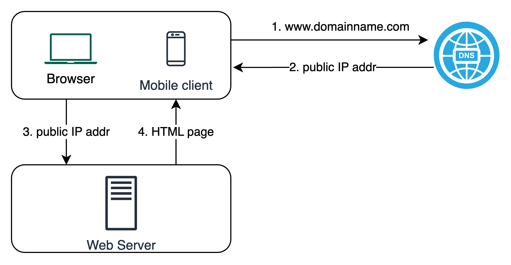
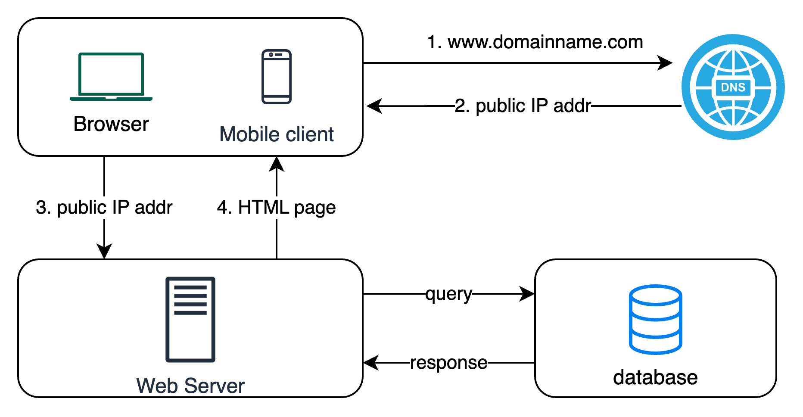

# Scaling from Zero to Millions of users

- Continuous refinement and endless improvement

## Single server setup

## Decouple database

- Separating web server (web tier) and database  (data tier) servers allows them to be scaled independently.
- DB to use:
  - SQL
  - NoSQL

