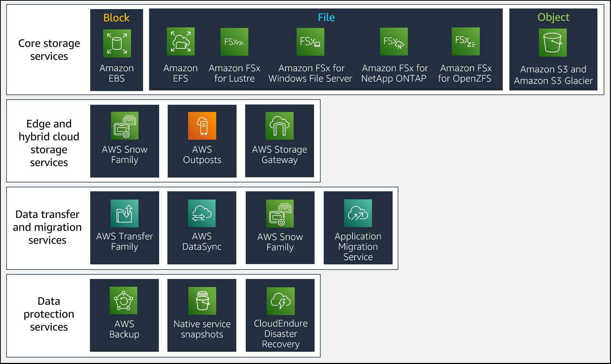
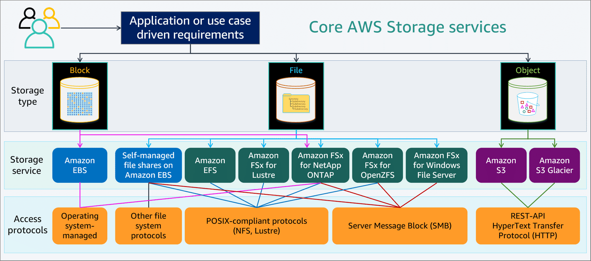

# Why organizations move to the cloud?

- Increase organizational agility
  - capacity planning, resource planning, budgeting
  - time to implement
  - provision capacity to deal with delays
  - unused provisioned capacity costs too
  - unused capacity can seldom changed to another usage
- Accelerate ability to innovate
  - demand to test/abandon new models/products
- Strengthen security
  - physical security access
  - consistent encryption of data at rest and in transit
  - user/group/role access control
  - external network attacks
- Reduce costs
  - Pay only for what you actually use
- Opex vs Capex

## Storage capacity categories

- Raw Capacity: hardward
- Formatted capacity
  - hardward failure protection overhead: redundant/mirroring, checksum
  - formatting/os overhead
- Allocated capacity: available capacity is reduced by data protection services: snapshots, performance overhead
- Remaining for actual capacity

## Primary storage types

- Block storage:
  - storage is formatted into predefined continuous segments on the storage device: blocks
  - the blocks are the basic storage units
  - storage devices can be HDD, SSD, NVMe (non-volatile Memory express)
  - deployment can be individual or storage area network (SAN)
- File storage
  - built on top of block storage
  - serving as a file share or file server
  - 2 common storage protocols are SMB (server message block) and NFS (network file system)
- Object storage
  - also built on top of block storage
  - object storage is created using an OS that formats and manages the reading/writing of data to the block storage devices.
  - unlike FS, object storage does not differentiate types of data. Type of data or file type are parts of the objects' metadata
  - an object is made up by a larger set of blocks organized by using a predefined size. For example, one object storage system uses binary objects of size 128 megabytes (MB). Smaller files/data are stored at a binary level within the object. Larger data files are stored by spreading the data across multiple objects.

## Edge and Hybrid cloud storage services

### Edge Local: Snow family

- Snowball devices: 2 options
  - storage optimized
  - compute optimized
- Snowcone devices: smallest devices of Snow family, weighing about 2.1 kg
- Snowmobile devices
  - the biggest of the Snow family
  - exabyte-scale data transfer service for large amount of data
  - upto 100PB

### Hybrid - storage - AWS Outposts

- on-premise cloud storage, fully managed service

### Hybrid - gatway - AWS storage gateway

- provide integration between an organization's on-premises IT environment and AWS storage infra.

# Identifying the right storage solution in the cloud

- No single data storage option is ideal for all workloads.
- When evaluating your storage requirements, consider data storage options for each workload separately.

## Block Storage: Amazon EBS

### Amazon EC2 instance store

- temporary block-level storage for your instances
- located on disks that are pysically attached to the host machine where the EC2 instance is allocated
- submillisecond latencies between the EC2 instance and the storage
- Only specific Amazon EC2 instance types support instance stores. The available storage type is directly associated to the EC2 instance type. An instance store consists of one or more instance store volumes exposed as block devices. The size of an instance store and the number of devices available vary by instance type.
- no replication, no high availability
- is terminated when the instance is terminated
- data is loss when the instance is
  - stopped
  - hibernated

### Amazon EBS

- suitable for use as primary storage for file systems, databases, or applications that require fine granular updates and access to raw, unformated, block-level storage.

