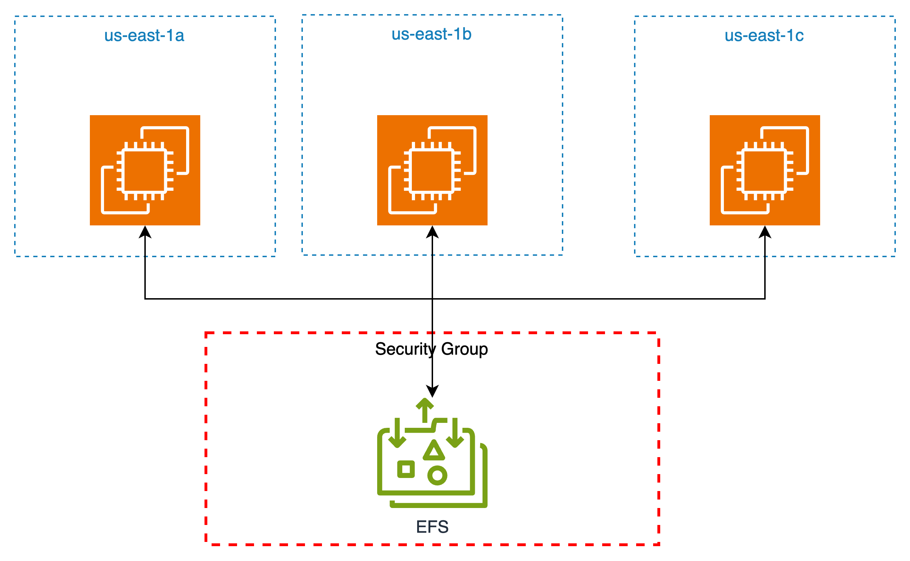
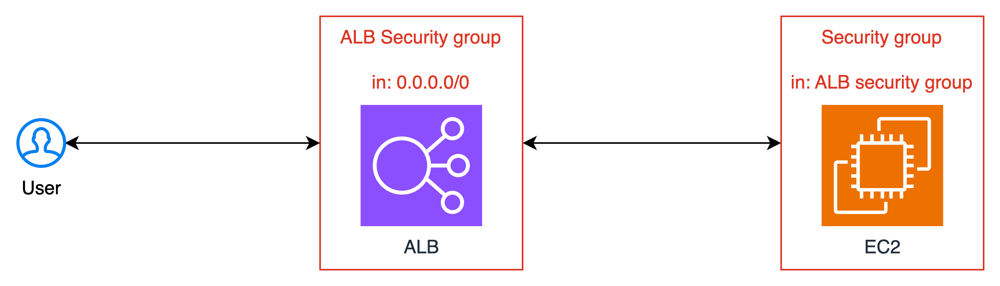
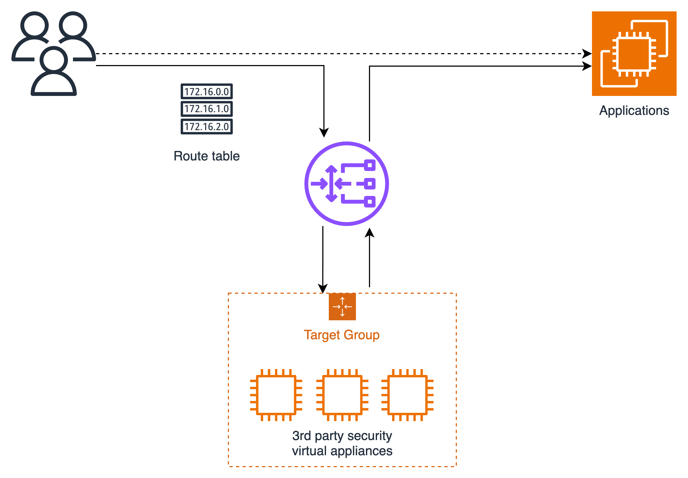
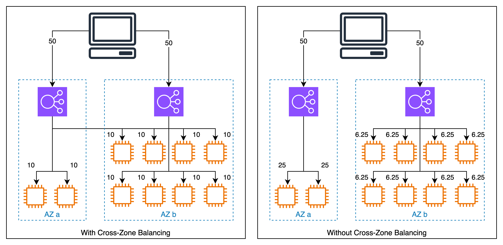
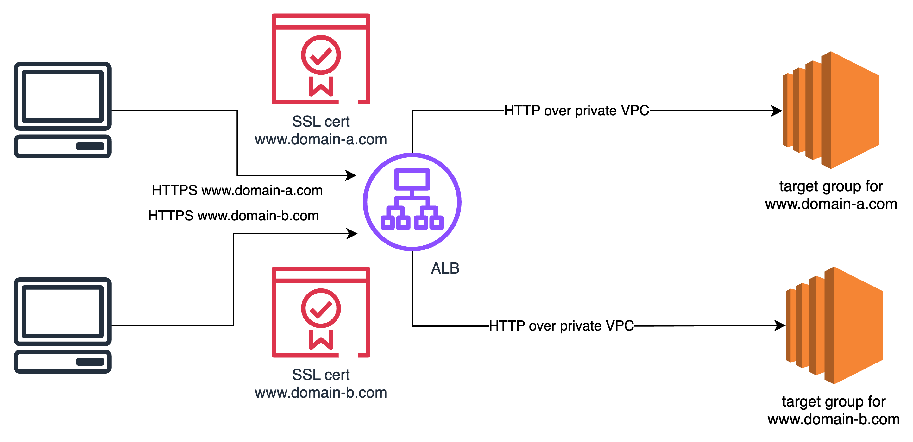

# Getting Started with AWS

## AWS cloud history

- 2002: internally launched
- 2003: Amazon infra is one of the core strength. Idea of to market
- 2004: launched publicly with SQS
- 2006: relaunched with SQS, S3, EC2
- 2007: launched in Europe
- 2024: AWS accounts for 31% of the market in Q1 (Azure seconds with 25%)

## AWS global infrastructure

- AWS regions
- AWS availability zones (AZ)
- AWS data centers
- AWS edge locations / points of presence

[AWS Infrastructure](https://infrastructure.aws/)

## AWS Regions

- A region is a cluster of data centers
- names can be us-east-1, eu-west-3, ...
- most AWS services are region-scoped

```
Question: if you launch a new application, where should you host it?
```

Factors to consider
- Compliance: data governance and legal requirements
- Proximity: close to customers to reduce the latency
- availability of services within a region: new services/features are not available in all regions
- pricing: price varies by region, and is transparent, found on service pricing pages.

## AWS Availability Zone

- each region has many AZs (usually 3, min is 2 and max is 6). Eg, region Sydney ap-southest-2 has 3 AZs:
  - ap-southest-2a
  - ap-southest-2b
  - ap-southest-2c
- each AZ is one or more data centers with redundant power, networking and connectivity
- they are separated from each other so that they are isolated from disasters.
- they are connected with high-bandwidth, ultra-low latency networking.

## AWS points of presence (Edge Locations)

- Content is delivered to end user with lower latency

## AWS global services

- Identity and Access Management (IAM)
- Route 53 (DNS)
- Cloudfront (Content Delivery Network)
- WAF (Web Application Firewall)
- ...

## Most AWS services are region-scoped

- EC2 (Infra as a service)
- Elastic Beanstack (Platform as a service)
- Lambda (Function as a service)
- Rekognition (Software as a service)

# IAM & AWS cli

Identity and Access Management, a global service

## IAM users & groups

- Root account is created by default, should not be used or shared
- Users are people within the organization, can be grouped
- Groups only contain users, not other groups
- Users can stand alone, do not belong to any group (not a best practice)
- Users can belong to multiple groups

## IAM policies

- Users and Groups can be assigned Json documents called Policies
- Policies define the permissions on AWS resources
  - Effect: allow or not
  - Action: do what
  - Resource: on which resources
- Least privilege principle: do not give more permissions than user needs.

## Hands-on: create IAM users, groups

- Login as root, go to IAM
- create a user, creating a group admin with AministratorAccess policy
- modify account alias to ease remembering login URL

## IAM policies

### IAM policies structure

```json
{
    "Version": "2012-10-17",
    "Id": "S3-Account-Permissions",
    "Statement": [
        {
            "Sid": "1",
            "Effect": "Allow",
            "Principal": {
                "AWS": ["arn:aws:iam::12345678:root"]
            },
            "Action": [
                "s3:GetObject",
                "s3:PutObject"
            ],
            "Resource": ["arn:aws:s3::mybucket/*"]
        }
    ]
}
```
- Version: policy language version, always "2012-10-17"
- Id: identifier of the policy, optional
- Statement: list of statements
  - Sid: identifier of the statement, optional
  - Effect: either Allow or Deny
  - Principal: account/role/user to which the policy applied to
  - Action: list of actions this policy allows or denies
  - Resource: list of resources to which the actions applied
  - Condition: conditions when the policy is applied, optional


## AWS access tools

- AWS web console
- aws cli
- aws sdk (multiple languages supported, eg boto for Python)


## AWS roles and services

- some aws services will need to perform actions on your behalf
- to do so, we will assign permissions to aws services with IAM roles

For example, we need to create EC2 VMs, that will need to access some aws resources. So we will need to create a role for the EC2 instances and assign permissions to this role.

## AWS security tools

- IAM credentials report (account level)
- IAM access advisor (user level)

## IAM best practices

- Do not user root user except for account setup
- one physical user = 1 IAM user
- assign users to groups, permissions to groups
- create a strong password policy
- enforce MFA
- create and use Roles for giving permissions to AWS services
- user access keys for progammatic access (cli, sdk)


# AWS EC2

## AWS budget setup

Make a budget alert

## EC2 basics

- EC2: Elastic Compute Cloud, is an IaaS
- It mainly contains
  - Renting VM (EC2)
  - storing data on virtual devices (EBS)
  - distributing load accross machines (ELB)
  - scaling the services using auto-scaling group (ASG)

### EC2 sizing and config options

- OS: linux, windows or macos
- CPU: compute power & cores
- RAM: how much memory
- Storage space:
  - network attached: EBS, EFS
  - hardware: EC2 instance store
- Network card: speed of the card, public IP address
- Firewall rules: security group
- Boostrap script (at first launch): EC2 user data
  - launching commands when a machine starts
  - run only once at the first start
  - used to automate boot tasks:
    - installing updates
    - installing softwares
    - download common data
    - ...

## Labs: create an EC2 instance

- OS: Amazon Linux 2
- architecture: 64-bit x86
- instance type: t2.micro (1 vCPU, 1G RAM)
- key pair: RSA public-private keys for ssh login
- Network:
  - auto assign public IP
  - security group: set of firewall rules. a new group is created by default
    - ssh: from anywhere, or known IP address
    - allow http (or https) from the internet
- Storate:
  - n G (EBS) for root volume
  - delete on termination (y/n)
  - encrypted (y/n)
- User data: install http server

```bash
#!/bin/bash

yum update -y
yum install -y httpd
systemctl start httpd
systemctl enable httpd
echo "<h1>Hello World from $(hostname -f)</h1>" > /var/www/html/index.html
```

## EC2 instance types

> m5.2xlarge

- m: instance class -> general purpose
- 5: generation
- 2xlarge: size within the instance class

### Classes

#### General purpose

- good for a diversity of workloads
- balance between
  - compute
  - memory
  - networking

#### Compute optimized

- good for compute-intensive tasks that require high performance processors
  - Batch processing
  - media transcoding
  - HPC
  - Scientific modeling, AI/ML
  - gaming servers

#### Memory optimized

- for workloads that process large datasets in memory
- use cases:
  - databases (query engine), particularly in-memory dbs
  - distributed web scale cache stores
  - applications performing real-time processing of big unstructured data

#### Storage optimized

- great for storage-intensive tasks that require high, sequential read/write of large datasets on local storage
- use cases:
  - high frequency OLTP systems
  - relational, no-sql databases
  - cache for in-memory databases
  - data warehousing applications
  - distributed file systems

## Security groups

- Security groups are the fundamentals of network security in AWS
- they control how traffic is allowed into or out of EC2 instances
- Security groups only contain **Allow** rules
- Security groups rules can reference by IP or by security group

Example
- type: HTTP
- protocol: TCP
- port range: 80
- source: 0.0.0.0/0 

Usage:
- Security groups can be attached to multiple instances
- locked down to a regions/VPC combination
- it's good to maintain one separate security group for SSH access
- if your application is not accessible (timeout), it's denied by security groups
- if the application gives a "connection refused" error, it's not from security group, the application could be down
- By default:
  - all inbound traffic is denied
  - all outbound traffic is allowed

Referencing other security groups

## SSH basics

```bash
$ ssh -i public_key_file.pem ec2-user@<ec2_intance_public_ip>
```

## EC2 instance roles

For example, if you want to use aws cli on the EC2 instance

```bash
$ aws iam list-users
```

you will not allow. You might think about configure aws cli with your user credentials. It's a bad practice to store credentials on EC2 instance.

- create a role for the EC2 instance
- attach a policy with IAM read access

## EC2 instances purchasing options

### EC2 on-demand

- pay as you use
- the highest cost but no upfront payment
- no long-term commitment 
- recommended for
  - short workload
  - unpredictable

### EC2 reserved

- up to 72% discount compared to on-demand
- you reserve a specific instance attributes (type, region, tenancy, os)
- reservation period: 1 year, 3 years (++discount)
- payment options: no upfront, partial upfront (++), all upfront (+++)
- reserved instance's scope: regional or zonal
- recommended for steady-stage usage applications (databases)
- can buy or sell in the Reserved Instance Marketplace

- Convertible Reserved Instance
  - can change EC2 instance type, family, os, tenacy
  - up to 66% discount

### EC2 saving plans

- get a discount based on long-term usage (up to 72% discount as reserved)
- commit to a certain type of usage (10$/hour for 1 or 3 years)
- usage beyond EC2 saving plans is billed by on-demand price
- locked to a specific instance family & region, eg. m5 in us-east-1
- flexibe across
  - instance size
  - os
  - tenancy (host, dedicated, default)


### spot instances

- can get up to 90% discount compared to on-demand
- instances that you can lose at any point of time if your max price is less than the current spot price
- the most cost-efficient instances in AWS
- useful for workloads that are resilient to failure
  - batch job
  - data analysis
  - image processing
  - workload with flexible start and end time
- not suitable for critical jobs or databases

### EC2 dedicated hosts

- a physical server with EC2 instance capacity fully dedicated
- allow to address compliance requirements and use the existing server-bound Software licenses (per socket, per core, per VM software licenses)
- purchasing options:
  - on-demand
  - reserved (1 or 3 years, no/partial/all upfront)
- the most expensive option
- useful for BYOL (bring your own license) model 

### EC2 dedicated instances

- instances run on hardwares dedicated to you
- may share hardware with other instances in the same account
- no control over instance replacement

### EC2 capacity reservations

- reserve on-demand instances capacity in a specific AZ for any duration
- always have access to EC2 capacity when need it
- no time commitment (create/cancel anytime), no billing discount
- can combine with Regional reserved Instances and Saving plans for discounts
- you are charged at on-demand rate whether you run instances or not
- suitable for short-term, uninterrupted workloads you need to run in a specific AZ


## EC2 public IPv4

- starting Feb 1st 2024, there's a charge for all public IPv4 created in your account
- Free tier: 750h of public IPv4 per month for the first 12 months
- No free tier for other services: IPv4 for
  - load balancer: 1 public IPv4 per AZ
  - RDS database: 1 public IPv4
- What about IPv6: not supported everywhere

## EC2 Spot Instances & Spot fleet

- can get a discount to 90% compared to on-demand instances
- define max spot price:
  - get instances when the current spot price is lower than the bidding max price
  - the spot price varies based on offer & capacity
  - when the spot price is higher than the bidding max spot pice:
    - you can choose to stop or terminate the instance within 2 minutes grace period
  - Spot block stratety:
    - block spot instance during a specific time frame (1-6 hours) without interruption
    - it's verry rare that the instances are reclaimed

### stop Splot instances:
- 1-time request
  - the instances are launched and the request expires
  - it's ok to just stop/terminate the instances
- persistent request:
  - if we stop/terminate instances: new instances will be launched to fulfill the request
  - we need to cancel the request first, then terminate the instances

### Spot fleets
- set of spot instances + (optional) on-demand instances
- will try to match the capacity with price constraints
- strategies:
  - lowest price
  - diversified
  - capacity optimized
  - price capacity optimized


# EC2 - Solutions Architect Associate level

## Private vs Public vs Elastic IPv4

- private IP: used within private network, cannot be seen on internet
- public IP: unique across the whole internet
- elastic IP: An Elastic IP address is a static IPv4 address, allocated to your AWS account, and is yours until you release it. By using an Elastic IP address, you can mask the failure of an instance or software by rapidly remapping the address to another instance in your account.

## EC2 Placement Groups

- Cluster: clusters intances into a low-latency group in a single AZ (high-risk of failure when 1 AZ is down)
- Spread: spreads instances across underlying hardware (max 7 intances per group per AZ): critical applications
- Partition: spreads intances across many different partitions (different sets of racks) within an AZ. Scales to 100s EC2 instances per group: Hadoop, Cassandra, Kafka

## Elastic Network Interfaces (ENI)

- logical component in a VPC that represents a virtual network card
- the ENI can have
  - one primary private IPv4, one or more secondary private IPv4
  - one elastic public IPv4 per private IPv4
  - one public IPv4
  - one or more security groups
  - one MAC address
- you can create ENI independently and attach them on the fly (or move them) on the EC2 instances
- bound to a specific AZ


## EC2 hibernate

- the in-memory state is preserved: RAM state is written into a file in the root EBS volume
- instance boot is faster
- root EBS volume must be encrypted and big enough to store the RAM state

# EC2 Instance Storage

## EBS overview

- Elastic Block Store is a network drive that can be attached to the instances while they run
- it allows instances to persist data, even after their termination
- they can be mounter to one instance at a time
- they are bounded to a specific AZ

## EBS volume

- a network drive
  - it uses network to communicate with EC2 instance -> a bit of latency
  - can be detached from 1 instance and attached to another
- it's locked to an AZ
  - to move across, you need to snapshot it
- has a provisioned capacity (size, IOPS)
  - billed for the provisioned capacity
  - you can increase the capacity over time

## EBS snapshots

- make a copy (snapshot) of EBS volume at a point of time
- not necessary to detatch the volume to do the snapshot but recommended
- can copy snapshot across AZ, region

### EBS snapshot features

- EBS snapshot archive
  - move snapshot to an "archive tier" that is 75% cheaper
  - takes within 24-27 hours for restoring
- Recycle Bin for snapshots
  - setup rules to retain deleted snapshot to recover them after accidental deletion
  - specify retention (1day to 1year)
- Fast snapshot restore (FSR)
  - force full initialization of snapshot to have no latency on the first use
  - expensive

## AMI overview

- AMI: amazon machine image
- AMI is a customization of an EC2 instance
  - you add your own software, configuration, OS, monitoring
  - faster boot/configuration time as all are pre-packed
- AMI are built for a specific region (can be copied across)
- you can launch EC2 instances from
  - a public AMI: Amazon provided
  - your own AMI: you make and maintain them yourself
  - an AWS marketplace AMI: someone else made and sold it on the marketplace

### AMI hands-on

1. create an EC2 instance with
   - user data: bash scripts for installing Apache httpd and systemctl enable it
2. create an AMI from it
3. create an EC2 instance from that AMI with
   - user data: scrip for just index.html for the web page


## EC2 instance store

- EBS volumes are network drives, good, but with limited performance
- If you need high-performance hardware disk, you should use EC2 instance store
  - better IO performance
  - EC2 instance store loses storage if they are stopped
  - good for buffer, cache, scratch data, temporary content
  - risk of data loss if hardware fails
- backups and replication are under your responsibility

## EBS volume types

6 types
- gp2/gp3: SSD, balance of price vs performance for wide variety of workloads
- io1/io2: highest performance SSD volumes, low-latency or high-throughput workloads
- st1: low cost HDD volume
- sc1: lowest cost HDD volume, for lest frequently accessed

## EBS Multi-attach (io1/io2 family)

- allow to attach 1 EBS volume to multiple EC2 instances in the same AZ
- full read&write permissions
- use cases:
  - higher application availability in clusterred Linux applications
  - applications must manage concurrent write
- limitations:
  - up to 16 instances at a time
  - must use a filesystem that is cluster-aware

## EBS encryption

- when you create an encrypted EBS volume
  - data rest is encrypted
  - all data in flight between instances and the volume is encrypted
  - all snapshots are encrypted
  - all volumes created from the snapshot is encrypted
- Copying an unencrypted snapshot allows encryption

### Encrypt an unencrypted volume

- create a snapshot of the unencrypted volume
- encrypt the snapshot (using copy)
- create a volume from the encrypted snapshot
- attach the encrypted volume to the original instance


## Amazon EFS

- Managed NFS that can be mounted on many EC2 instances
- EFS works with EC2 instances in multi-AZ
- Highly available, scalable, expensive (3x gp2), pay per use



### Use cases

- Content management, web serving, data sharing, wordpress
- Use Security Group to control access to EFS
- Compatible with Linux based AMI, not windows
- Encryption at rest using KMS
- POSIX filesystem
- Scale automatically, pay-per-use, no capacity planning

### EFS performance

- Scale
  - 1000s concurrent NFS clients, 10+ GB/s
  - grow to Petabyte scale, automatically
- Performance mode (set at creation time)
  - General purpose: latency-sensitive use cases
  - Max I/O: higher latency, throughput, highly parallel (big data processing)
- Throughput mode
  - Bursting - 1 TB: 50MiB/s + burst up to 100 MiB/s
  - Provisioned: set throughput regardless of storage size: eg. 1 GiB/s for 1TByte
  - elastic: up/down based on your workloads
    - up to 3GiB/s for read and 1 GiB/s for write
    - unpredicted workloads

### EFS storage classes

- Storage Tiers
  - standard: frequently accessed files
  - infrequent access (EFS-IA): costs to retrieve files, lower price to store
  - archive: rarely accessed files (few times per year)
  - Implement lifecycle policies to move files between storage tiers
- Availability and Durability
  - standard multi-AZ: great for production
  - one zone: only 1 AZ: for dev, backup enabled, compatible with IA (EFS onezone-IA)

# High Availability and Scalability: ELB & ASG

## Scalability
- Scalability means that an application/system can handle greater loads by adapting
- 2 kinds:
  - Vertical scalability: increase size of the instance
    - more RAM, disk, CPU, network bandwidth
  - Horizontal scalability (elasticity): increase number of instances
    - implies distributed, parallel/concurrent systems
    - modern systems
- Scalability is linked to but different from High Availability


## High Availability

- High Availability means running your application/system in at least 2 data centers (AZ)
- goal: survive a data center loss
- Passive: multiple AZ
- Active: scale horizontally

## Scalability & HA for EC2

- Vertically scaling: instance sizes
  - from t2.nano (0.5G RAM, 1 vCPU)
  - to u-24tb1.metal (24.5 TB RAM, 448 vCPUs)
- Horizontally scaling: number of instances
  - auto scaling group
  - load balancer
- High Availability: run the instances for the same application across multiple AZ
  - auto scaling group multi AZ
  - load balancer multi AZ

## Elastic Load Balancing

- Load balancers are servers that forward traffic to multiple servers downstream
- Usage
  - spread load across multiple downstream instances
  - expose a single point of access (via DNS) to your application
  - seamlessly handle failures of downstream instances:
    - health check
    - http /health
  - provide SSL termination
  - enforce stickiness with cookies
  - high availability across AZs
  - separate public traffic from private traffic
- Elastic Load Balancer:
  - AWS managed load balancer
  - integrated with many AWS services
    - EC2, EC2 auto scaling group, ECS
    - AWS certificate manager (ACM), CloudWatch
    - Route 53, AWS WAF, AWS global accelerator
- Types of ELB
  - Classic LB (HTTP, HTTPS, TCP, SSL): deprecated
  - Application LB (HTTP, HTTPS, WebSocket)
  - Network LB (TCP, TLS, UDP)
  - Gateway LB (layer 3, IP protocol)
- Some load balancers can be setup as internal (private) or external (public) ELB




### Application Load Balancer (v2)

- Application (level 7) LB: HTTP
- load balancing to multiple HTTP applications across machines: target groups
- load balancing to multiple applications on the same machine
- support HTTP/2 and WebSocket
- support redirect (HTTP to HTTPS)
- Routing to different target groups:
  - based on path in URL: example.com/users vs example.com/posts
  - based on hostname in URL: example.com/ vs otherexample.com/
  - based on query string, headers: example.com/users?id=123&order=false vs example.com/users?id=456&order=false
- ALB usage:
  - microservices
  - container-based application
- Target groups:
  - EC2 instances (can be managed by an Auto scaling group) - HTTP
  - ECS tasks - HTTP
  - Lambda functions
  - IP addresses - must be private IPs
- ALB can rounte to multiple target groups
- Health checks are at the target group level


### Network Load Balancer (v2)

- Network load balancer (layer 4):
  - forward TCP/UDP traffic to your instances
  - handle millions of request per seconds
  - ultra-low latency
- One public IPv4 per AZ
- Used for extreme performance, TCP/UDP traffic
- Not included in free tier
- Target groups:
  - EC2 instances
  - private IP addresses
  - Application LB
  - health check supports TCP, HTTP, HTTPS

### Gateway LB

- Deploy, scale and manage a fleet of 3rd party network virtual appliances
- Ex: firewalls, instrusion detection and prevention systems, deep packet inspection systems, payload manipulation,...
- Operates at layer 3 (Network) - IP packets
- functions:
  - transparent network gateway: single entry/exit for all traffic
  - load balancer: distributes traffic to your virtual appliances
- Use the GENEVE protocol on port 6081
- Target groups:
  - EC2 instances
  - Private IPs



### Elastic Load Balancer - Sticky Sessions

- stickiness: the same client is always redirected to the same instance behind the load balancer
- works with ALB, NLB
- the cookie used for stickiness has an expiration date you control
- enabling stickiness may bring imbalance to the load over the backends
- Cookies
  - Application-based cookies
    - Custom cookie
      - generated by target
      - can include attributes required by the applicaiton
      - cookie name must be specified for each target group
      - should not conflict reserved cookie names of ELB
    - Application cookies
      - generated by the load balancer
      - cookie name is AWSALBAPP
  - Duration-based cookies
    - generated by the load balancer
    - name is AWSALB for ALB, AWSELB for Classic LB

### Cross-Zone Load Balancing



- Application Load Balancer:
  - Cross-AZ load balancing is enabled by default (can disable a target group level)
  - No charges for inter AZ data transfer
- Network Load Balancer & Gateway LB
  - disabled by default
  - you pay charges for inter AZ data if enabled


### SSL (TSL) certificates

- the load balancer uses an X.509 certificate (SSL/TLS server certificate)
- you can manage certificates using ACM (Amazon certificate manager)
- you can create/upload your own certificates alternatively
- HTTPS listener:
  - you must speficy a default certificate
  - you can add optional list of certificates to support multiple domains
  - client can use SNI (server name indication) to specify the hostname they reach.



### Connection Draining

- time to complete "in-flight requests" for de-registring instances
- stop sending new requests to the EC2 instances which is de-registring
- between 0 (not activated) to 3600 s (1 hour).