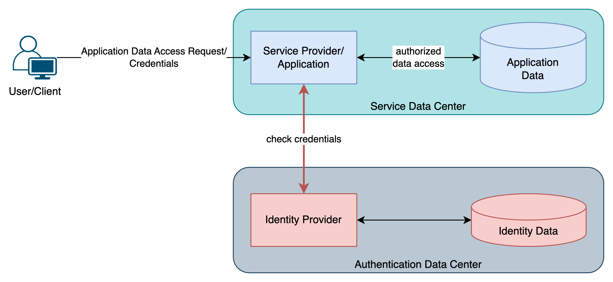
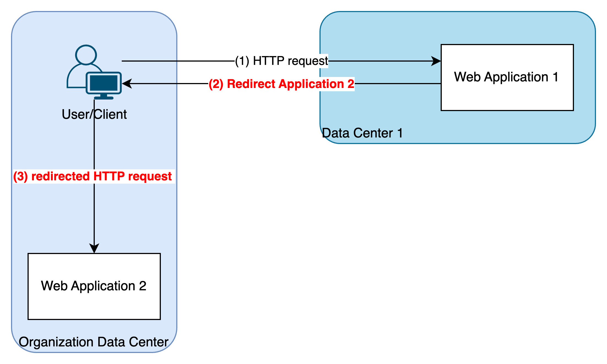
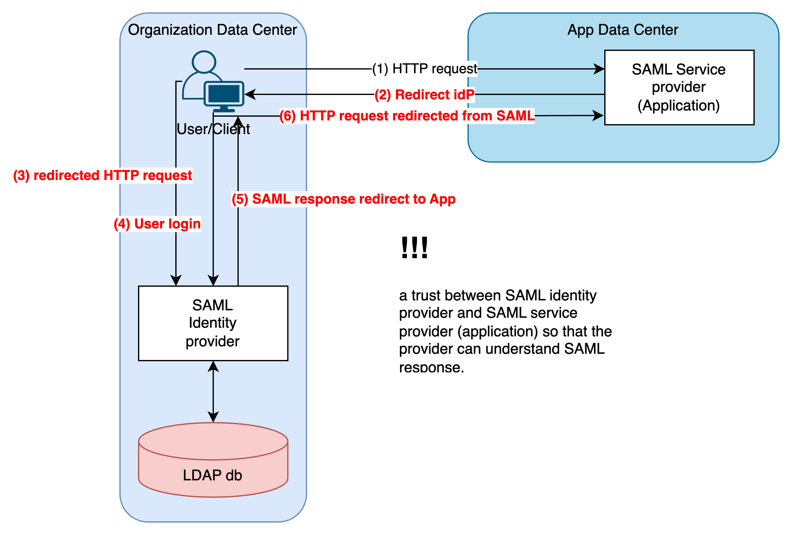
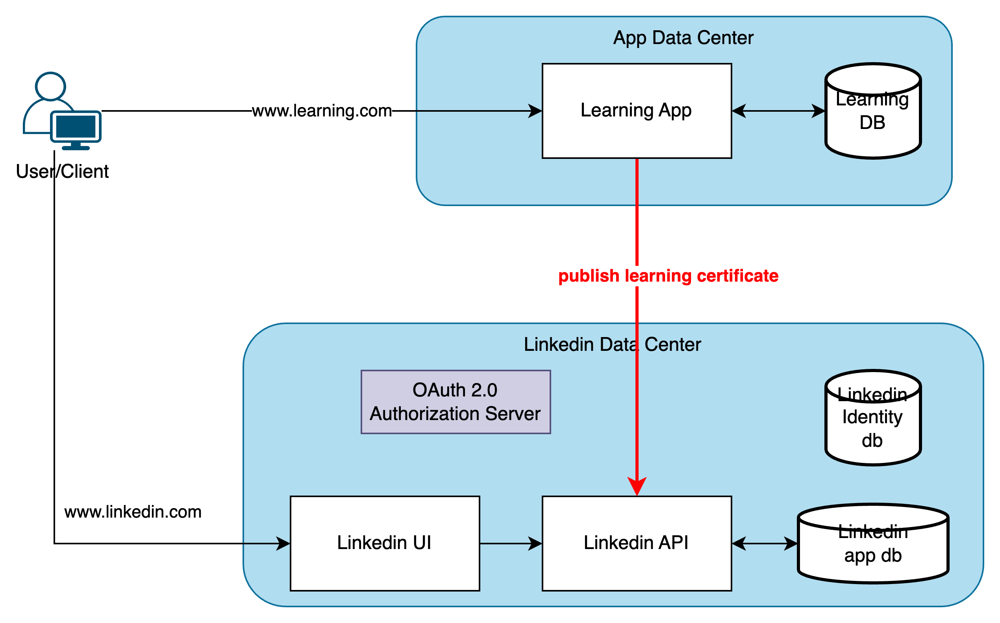

# LDAP and SAML

## Overview and Security Basics

### Security Basics - Providers

- User, Identity
  - who is using?
  - identity information is stored in LDAP, Active Directory, ...
- Authentication
  - validate the credentials provided by the client/user
- Authorization
  - service provider (application) grant resources to the identity appropriately (role/group-based, ...)
  

### LDAP - Lightweight Directory Access Protocol

Homegrown

- Identity: stored in application database
- Authentication: done by application
- Authorization: done by application
- Down side:
  - each application has its own identity store, no centralized identity store: add new, update
  - credentials are store in application store, can be exposed to developers
  - users can have different username/password in different applications

LDAP
- Identity: stored in LDAP database, Microsoft Active Directory
- Authentication: done by LDAP (AD)
- Authorization: done by applications
- LDAP and Application are in the same datacenter
- Down side:
  - LDAP is over TCP
  - application cannot access LDAP server in a different datacenter
  - user/password are still sent to application (exposed to security risk by application codes: logging, caching, ...)

## SAML - Security Assertion Markup Language

HTTP redirect is an important mechanism

- Avoid entering the user credentials (use SSO)
- Application redirected from corporate network (SSO)

wiht SAML

- Identity: stored in LDAP database
- Authentication:
  - done by SAML identity provider
  - application redirects request to SAML provider
- Authorization: application controls it, with LDAP groups

## Problems still

An application calls another application
- Microservices
- Social Networks

# OAuth 2.0 fundamentals

RFC 6749
> The OAuth 2.0 authorization framework enables a third-party application to obtain a **limited** access to **an HTTP** service, either **on-behalf of a resource owner** by orchestrating an **approval interaction** between the resource and the HTTP service, or by allowing the third-party application to obtain **access on its own behalf**.

## OAuth 2.0 - Roles

- Resource Owner
  - user
- Resource Server
  - HTTP REST API with resource protection
- Client
  - application that needs resource access
- Authorization Server
  - authorizes the client
  - gives out access credentials
  - OAuth endpoints

## OAuth 2.0 - Client Registration

# Grants deep dive with Google
# Grants deep dive with Okta
# OAuth 2.0 in the enterprise
# SPA with Oauth
# Native Applications
# Applications on other devices