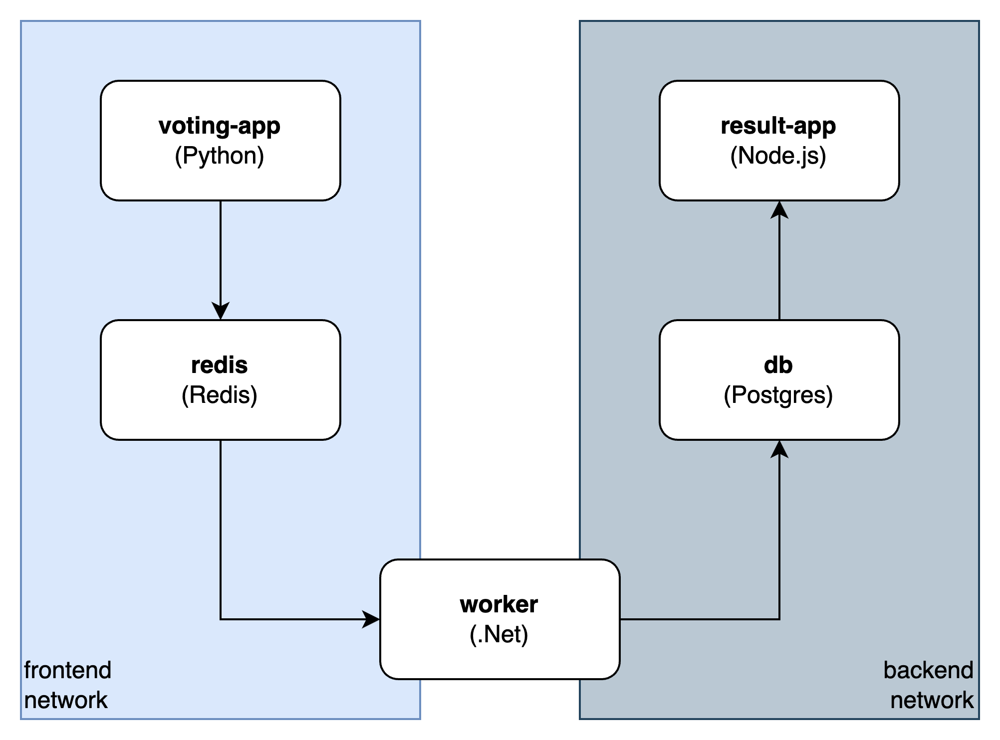
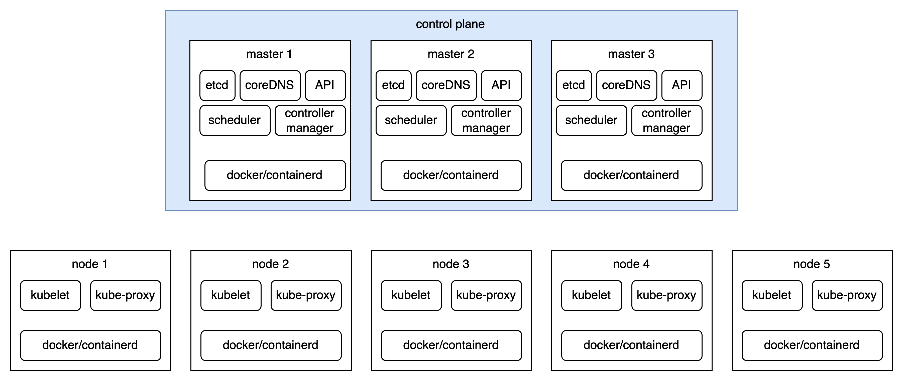
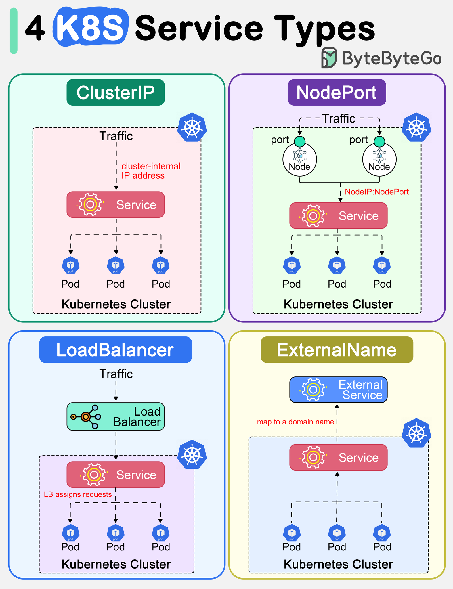

# Why Docker?

Packaging problems

- Isolation
  - -> VM?
- Environments
  - all of dependencies, required libraries
- Speed
  - dev/build/test faster
  - faster cycle

# Installing Docker

## Docker cli

- Remote ssh host:

```sh
export DOCKER_HOST=ssh://docker_user@<ipaddress>
```

- Multiple Engines

```sh
docker context --help
```

# Creating and Using Containers

```sh
$ docker version
Client:
 Version:           27.2.0
 API version:       1.47
 Go version:        go1.21.13
 Git commit:        3ab4256
 Built:             Tue Aug 27 14:14:45 2024
 OS/Arch:           darwin/arm64
 Context:           desktop-linux

Server: Docker Desktop 4.34.3 (170107)
 Engine:
  Version:          27.2.0
  API version:      1.47 (minimum version 1.24)
  Go version:       go1.21.13
  Git commit:       3ab5c7d
  Built:            Tue Aug 27 14:15:41 2024
  OS/Arch:          linux/arm64
  Experimental:     false
 containerd:
  Version:          1.7.20
  GitCommit:        8fc6bcff51318944179630522a095cc9dbf9f353
 runc:
  Version:          1.1.13
  GitCommit:        v1.1.13-0-g58aa920
 docker-init:
  Version:          0.19.0
  GitCommit:        de40ad0

```

## Run a nginx container

### run a container

1. docker looks for the image in the local image cache
2. if it does not find, it looks in the remote image repository (defaults to Docker Hub)
3. downloads the specified or latest version
4. creates a container based on the found image and prepares to start
5. give it a virtual IP on a private network inside the docker engine
6. starts container by using the CMD (command) specified in the image Dockerfile


```sh
docker container run --publish 8080:80 nginx
```

detach mode

```sh
docker container run --publish 8080:80 --detach nginx
```

### list running containers

```sh
docker container ls
```

### list all containers

```sh
docker container ls -a
```

## Assignment

1. run a nginx, a mysql, a httpd server
2. run all in detach mode, name them with --name
3. publish their port on 8080, 8081, 3306

```sh
$ docker run --publish 8080:80 --detach --name=nginx_proxy nginx:latest
$ docker run --publish 8081:80 --detach --name=web_server httpd:latest
$ docker run --publish 3306:3306 --detach --name=mysql_db --env MYSQL_RANDOM_ROOT_PASSWORD=yes mysql
```

## Monitoring containers with CLI

Top processes running in the container:
```sh
$ docker container top <container>
```

other commands
- docker container inspect
- docker container stats
- docker container logs
- ...

```sh
$ docker container run --publish 8080:80 --detach --name=nginx_proxy nginx
$ docker container stats

CONTAINER ID   NAME          CPU %     MEM USAGE / LIMIT     MEM %     NET I/O           BLOCK I/O         PIDS
a78aa00061b2   nginx_proxy   0.00%     17.81MiB / 7.655GiB   0.23%     2.26kB / 1.27kB   12.7MB / 12.3kB   9
```

### Get a Shell inside a container

- a new container interactively
  ```
  $ docker container run -it ... bash
  ```
- an existing, runing container
  ```
  $ docker container exec -it <container> bash
  ```

  ## Docker Netowrks - Concepts

  - each container connects to a private virtual network "bridge".
  - each virtual network routes through NAT firewall on host IP
  - all container on a virtual network can talk to each other without -p
  - best practices: a virtual network for each application, e.g:
    - "my_web_app" for mysql and php/apache containers
    - "my_api" for mongo and nodejs containers

```bash
$ docker container inspect --format "{{ .NetworkSettings.IPAddress }}" nginx_proxy
172.17.0.2
```

```bash
$ docker container port nginx_proxy                                              
80/tcp -> 0.0.0.0:8080
```

### Virtual network management with CLI

```bash
$ docker network ls
NETWORK ID     NAME                       DRIVER    SCOPE
f2d07368ad2e   bridge                     bridge    local
4b8507a6752a   host                       host      local
cd092ed1b078   minikube                   bridge    local
414dfa1e555b   none                       null      local
dce665f8212f   spark-cluster_default      bridge    local
e0aca30bbcca   spark-essentials_default   bridge    local
```

```bash
$ docker network inspect bridge

[
    {
        "Name": "bridge",
        "Id": "f2d07368ad2eb277dc1d875a44e81eb051e589618c73d9994de7ca6e8ba13246",
        "Created": "2024-12-14T05:13:09.814879625Z",
        "Scope": "local",
        "Driver": "bridge",
        "EnableIPv6": false,
        "IPAM": {
            "Driver": "default",
            "Options": null,
            "Config": [
                {
                    "Subnet": "172.17.0.0/16",
                    "Gateway": "172.17.0.1"
                }
            ]
        },
        "Internal": false,
        "Attachable": false,
        "Ingress": false,
        "ConfigFrom": {
            "Network": ""
        },
        "ConfigOnly": false,
        "Containers": {
            "a78aa00061b2fbcf95267f8196c0dffa57c43fa1d063aaff9bc540c32eef5605": {
                "Name": "nginx_proxy",
                "EndpointID": "93f58859ebd1426fd104d39afc88be4b877221f00d114cb08df8c96ca62cdf03",
                "MacAddress": "02:42:ac:11:00:02",
                "IPv4Address": "172.17.0.2/16",
                "IPv6Address": ""
            }
        },
        "Options": {
            "com.docker.network.bridge.default_bridge": "true",
            "com.docker.network.bridge.enable_icc": "true",
            "com.docker.network.bridge.enable_ip_masquerade": "true",
            "com.docker.network.bridge.host_binding_ipv4": "0.0.0.0",
            "com.docker.network.bridge.name": "docker0",
            "com.docker.network.driver.mtu": "65535"
        },
        "Labels": {}
    }
]

```

- Create a virtual network (bridge by default)

```bash
$ docker network create my_app_net
$ docket network ls
$ docker network inspect my_app_net
[
    {
        "Name": "my_app_net",
        "Id": "c43f90344c078ff48a7723e60dd2f4717c140b73912d6bb9b476006e54f5ae01",
        "Created": "2024-12-14T08:41:00.123412001Z",
        "Scope": "local",
        "Driver": "bridge",
        "EnableIPv6": false,
        "IPAM": {
            "Driver": "default",
            "Options": {},
            "Config": [
                {
                    "Subnet": "172.18.0.0/16",
                    "Gateway": "172.18.0.1"
                }
            ]
        },
        "Internal": false,
        "Attachable": false,
        "Ingress": false,
        "ConfigFrom": {
            "Network": ""
        },
        "ConfigOnly": false,
        "Containers": {},
        "Options": {},
        "Labels": {}
    }
]
```

- connect a container to the network

```bash
$ docker network connect my_app_net nginx_proxy
$ docker container inspect nginx_proxy

..          "Networks": {
                "bridge": {
                    "IPAMConfig": null,
                    "Links": null,
                    "Aliases": null,
                    "MacAddress": "02:42:ac:11:00:02",
                    "DriverOpts": null,
                    "NetworkID": "f2d07368ad2eb277dc1d875a44e81eb051e589618c73d9994de7ca6e8ba13246",
                    "EndpointID": "93f58859ebd1426fd104d39afc88be4b877221f00d114cb08df8c96ca62cdf03",
                    "Gateway": "172.17.0.1",
                    "IPAddress": "172.17.0.2",
                    "IPPrefixLen": 16,
                    "IPv6Gateway": "",
                    "GlobalIPv6Address": "",
                    "GlobalIPv6PrefixLen": 0,
                    "DNSNames": null
                },
                "my_app_net": {
                    "IPAMConfig": {},
                    "Links": null,
                    "Aliases": [],
                    "MacAddress": "02:42:ac:12:00:02",
                    "DriverOpts": {},
                    "NetworkID": "c43f90344c078ff48a7723e60dd2f4717c140b73912d6bb9b476006e54f5ae01",
                    "EndpointID": "2811d67cfb23ea201b262ba54856fdf9ab0be40341cf052e42e28e628ed81400",
                    "Gateway": "172.18.0.1",
                    "IPAddress": "172.18.0.2",
                    "IPPrefixLen": 16,
                    "IPv6Gateway": "",
                    "GlobalIPv6Address": "",
                    "GlobalIPv6PrefixLen": 0,
                    "DNSNames": [
                        "nginx_proxy",
                        "a78aa00061b2"
                    ]
                }
            }
        }
    }
]

```

- disconnect a container from a network

```bash
$ docker network disconnect my_app_net nginx_proxy
```

- remove a network

```bash
$ docker network rm my_app_net
my_app_net
```


### DNS: how containers find each other

- docker uses container names as host names for DNS
- containers should not rely on IP addresses for inter-communication

```bash
$ docker network create my_app_net
$ docker container run --detach --network=my_app_net --name=my_nginx1 nginx
$ docker container run --detach --network=my_app_net --name=my_nginx2 nginx
$ docker network inspect my_app_net

[
    {
        "Name": "my_app_net",
        "Id": "a4e8149d11b28b6aa1953332178b0bf6b3e4b2177293e116a22d09f8b4c89fd5",
        "Created": "2024-12-14T08:58:17.203066217Z",
        "Scope": "local",
        "Driver": "bridge",
        "EnableIPv6": false,
        "IPAM": {
            "Driver": "default",
            "Options": {},
            "Config": [
                {
                    "Subnet": "172.18.0.0/16",
                    "Gateway": "172.18.0.1"
                }
            ]
        },
        "Internal": false,
        "Attachable": false,
        "Ingress": false,
        "ConfigFrom": {
            "Network": ""
        },
        "ConfigOnly": false,
        "Containers": {
            "71977e79c31c7e67b16d8004f3240decffef4a754341be9b21a137e7b5674898": {
                "Name": "my_nginx1",
                "EndpointID": "8e650a9f220646c98d71bd639a34aef1c1f811d6bd4a85b5e1940ff6d9f602bd",
                "MacAddress": "02:42:ac:12:00:02",
                "IPv4Address": "172.18.0.2/16",
                "IPv6Address": ""
            },
            "71cd56e14e71a08b6a9db7103b50c5b445f32619d47e80259d7314d1a508ee92": {
                "Name": "my_nginx2",
                "EndpointID": "6ff8d2165a508303322d4bd74f939bb47cbc9e761c7eceeaf315237137b20796",
                "MacAddress": "02:42:ac:12:00:03",
                "IPv4Address": "172.18.0.3/16",
                "IPv6Address": ""
            }
        },
        "Options": {},
        "Labels": {}
    }
]

```

- 2 containers on the same virtual net

```bash
$ docker container exec -it my_nginx1 ping my_nginx2
PING my_nginx2 (172.18.0.3) 56(84) bytes of data.
64 bytes from my_nginx2.my_app_net (172.18.0.3): icmp_seq=1 ttl=64 time=0.079 ms
64 bytes from my_nginx2.my_app_net (172.18.0.3): icmp_seq=2 ttl=64 time=0.200 ms
64 bytes from my_nginx2.my_app_net (172.18.0.3): icmp_seq=3 ttl=64 time=0.190 ms
```

- but not the other container on default virtual network

```bash
$ docker container exec -it my_nginx1 ping nginx_proxy
ping: nginx_proxy: Name or service not known
```

- now connect the other container to my_app_net too

```bash
$ docker network connect my_app_net nginx_proxy
$ docker container exec -it my_nginx1 ping nginx_proxy
PING nginx_proxy (172.18.0.4) 56(84) bytes of data.
64 bytes from nginx_proxy.my_app_net (172.18.0.4): icmp_seq=1 ttl=64 time=0.191 ms
64 bytes from nginx_proxy.my_app_net (172.18.0.4): icmp_seq=2 ttl=64 time=0.170 ms
^C
```

## Assignment: docker CLI

- use --rm to cleanup the container when it stops
```bash
$ docker container run --rm -it ubuntu:latest bash
```

## Assignment - DNS round robin

- for load ballancing: assign many containers in the same virtual network to a same name for DNS

```bash
$ docker network create search_net
$ docker container run -d --net search_net --network-alias search elasticsearch
$ docker container run -d --net search_net --network-alias search elasticsearch
$ docker container run -it --rm --net search_net alpine nslookup search
```

- the above create 2 identical containers elasticsear on the same alias on the same network
- if we query elasticsearch, it can route to both alternatively

```bash
$ docker container run -it --rm --net search_net alpine curl  -s search:9200
```

# Container Images

## What is an image

- Application binaries and dependencies
- metadata about the image data and how to run
- "an image is an ordered collection of root filesystem changes and the corresponding execution parameters for use within a container runtime"
- not a complete OS, no kernel, kernel modules (drivers)
- can be small as 1 file like a go static library
- or big as a Ubuntu distro with apt, Apache, PHP, ... installed.

## Image layers

```bash
$ docker image history nginx
```

```bash
$ docker image inspect nginx
```

# Persistent Data: Volumes

- containers are usually immutable and ephemeral
  - only re-deploy containers, nerver change
- what about databases, unique data
  - known as persistent data
- two ways:
  - volumes: make special location outside of container UFS
  - bind mounts: link container path to host path

## Volume

- when the image requires a volume, specified in Dockerfile, docker engine create and assign volume, default in /var/lib/docker/volumes/ for it.
- the volume is kept even though the container is stoped or removed.

```bash
$ docker container run -d --name mysql_server --env MYSQL_ALLOW_EMPTY_PASSWORD=yes mysql
8b1154efca4b41b1039ee3294ee2555175e9caaa5b68f8323a074ddce54fd061
```

```bash
$ docker container inspect mysql_server
...
        "Mounts": [
            {
                "Type": "volume",
                "Name": "2054aab0b06a6c52161b4f7c1d7945db69b62102ff5fdf78b589e054387af0e3",
                "Source": "/var/lib/docker/volumes/2054aab0b06a6c52161b4f7c1d7945db69b62102ff5fdf78b589e054387af0e3/_data",
                "Destination": "/var/lib/mysql",
                "Driver": "local",
                "Mode": "",
                "RW": true,
                "Propagation": ""
            }
        ],
...
            "Volumes": {
                "/var/lib/mysql": {}
            },
```

```bash
$ docker container stop mysql_server
$ docker container rm mysql_server
$ docker volume ls
DRIVER    VOLUME NAME
...
local     2054aab0b06a6c52161b4f7c1d7945db69b62102ff5fdf78b589e054387af0e3
...
```

- we need to clean it if we need to

```bash
$ docker volume rm 2054aab0b06a6c52161b4f7c1d7945db69b62102ff5fdf78b589e054387af0e3
```

### Best practice: specify the volume name

```bash
$ docker container run -d --name mysql_server --env MYSQL_ALLOW_EMPTY_PASSWORD=yes -v mysql-data:/var/lib/mysql mysql
```

```bash
$ docker volume ls
DRIVER    VOLUME NAME
...
local     mysql-data
...

$ docker container inspect mysql_server

...
         "Mounts": [
            {
                "Type": "volume",
                "Name": "mysql-data",
                "Source": "/var/lib/docker/volumes/mysql-data/_data",
                "Destination": "/var/lib/mysql",
                "Driver": "local",
                "Mode": "z",
                "RW": true,
                "Propagation": ""
            }
        ],
        ...
```

## Bind mounting

- maps host file/directory to a container one

Dockerfile
```docker
FROM nginx:latest

WORKDIR /user/share/nginx/html

# COPY index.html index.html
```

```bash
$ docker container run -d --publis 8080:80 -v $(pwd):/user/share/nginx/html nginx
```

# Docker Compose

template

```yaml
version: '3.1'

services:
    servicename: # dns name inside the network
        image: # image, optional if use build
        command: # optional, default is the CMD in dockerfile
        environment: # optional, as -env in docker run command
        ports: # optional, the same as --publish as docker run
        volumes: # optional, as -v in docker run
    servicename2:
        ...


volumes: # optional, the same as docker volume create
networks: # optional, the same as docker network create
```

## Add image building into Compose File

```yml
services:
    serice-1:
        image: <image_name>
        container_name: <container_name> # used for DNS too
        build: <path to Dockerfile for build>
        environment:
            - ENV_VAR1=...
            - ENV_VAR2=...
        volumes:
            - volume1:...
            - volume2:...
        networks:
            - network-1
            - network-2

volumes:
    volume1:
    volume2:
networks:
    network-1:
    network-2:
```

# Swarm

- swarm mode is a built-in orchestration solution
- not active by default

```bash
$ docker info
...
Swarm: inactive
...
```

Init a swarm raft
```bash
$ docker swarm init

Swarm initialized: current node (t1zbpu77vzv4kkdlnkn7luw0h) is now a manager.
To add a worker to this swarm, run the following command:

    docker swarm join --token SWMTKN-1-1uaounq2n2bx05xfh55owymcp4xynxs7e1c568o9k8ui6x6rqw-c92ljw3ejmr8n3h97jmqopr0w 192.168.65.3:2377

To add a manager to this swarm, run 'docker swarm join-token manager' and follow the instructions.
```

What happened?

- Security and KPI automation:
  - root signing certificate created for the swarm
  - certificate issued for the first manager node
  - join tokens are created
- Raft database created to store root CA, configs and secrets

## Some other command with swarm

```bash
$ docker node --help

Usage:  docker node COMMAND

Manage Swarm nodes

Commands:
  demote      Demote one or more nodes from manager in the swarm
  inspect     Display detailed information on one or more nodes
  ls          List nodes in the swarm
  promote     Promote one or more nodes to manager in the swarm
  ps          List tasks running on one or more nodes, defaults to current node
  rm          Remove one or more nodes from the swarm
  update      Update a node

$ docker swarm --help

Usage:  docker swarm COMMAND

Manage Swarm

Commands:
  ca          Display and rotate the root CA
  init        Initialize a swarm
  join        Join a swarm as a node and/or manager
  join-token  Manage join tokens
  leave       Leave the swarm
  unlock      Unlock swarm
  unlock-key  Manage the unlock key
  update      Update the swarm

Run 'docker swarm COMMAND --help' for more information on a command.
```

## Create a service in swarm

```bash
docker service create alpine ping 8.8.8.8
uqawbysqzlvxe0ohfar4cmfrm
overall progress: 1 out of 1 tasks 
1/1: running   [==================================================>] 
verify: Service uqawbysqzlvxe0ohfar4cmfrm converged
```

```bash
$ docker service ls
ID             NAME              MODE         REPLICAS   IMAGE           PORTS
uqawbysqzlvx   vigilant_spence   replicated   1/1        alpine:latest
```

```bash
$ docker service ps vigilant_spence
ID             NAME                IMAGE           NODE             DESIRED STATE   CURRENT STATE                ERROR     PORTS
vosd18xuc14e   vigilant_spence.1   alpine:latest   docker-desktop   Running         Running about a minute ago 
```

```bash
$ docker container ls
CONTAINER ID   IMAGE           COMMAND          CREATED         STATUS         PORTS     NAMES
d4e3be9de0e2   alpine:latest   "ping 8.8.8.8"   2 minutes ago   Up 2 minutes             vigilant_spence.1.vosd18xuc14easdpoydwa4x53
$ docker container stop d4e3be9de0e2
d4e3be9de0e2
$ docker service ps vigilant_spence 
ID             NAME                    IMAGE           NODE             DESIRED STATE   CURRENT STATE           ERROR                         PORTS
fj391eqcpv8u   vigilant_spence.1       alpine:latest   docker-desktop   Running         Running 5 seconds ago                                 
vosd18xuc14e    \_ vigilant_spence.1   alpine:latest   docker-desktop   Shutdown        Failed 10 seconds ago   "task: non-zero exit (137)"   
```

## Scale a service

```bash
$ docker service update vigilant_spence --replicas 3
vigilant_spence
overall progress: 3 out of 3 tasks 
1/3: running   [==================================================>] 
2/3: running   [==================================================>] 
3/3: running   [==================================================>] 
verify: Service vigilant_spence converged

$ docker service ps vigilant_spence                 
ID             NAME                    IMAGE           NODE             DESIRED STATE   CURRENT STATE            ERROR                         PORTS
fj391eqcpv8u   vigilant_spence.1       alpine:latest   docker-desktop   Running         Running 3 minutes ago                                  
vosd18xuc14e    \_ vigilant_spence.1   alpine:latest   docker-desktop   Shutdown        Failed 3 minutes ago     "task: non-zero exit (137)"   
pyhyf9qvp4gb   vigilant_spence.2       alpine:latest   docker-desktop   Running         Running 39 seconds ago                                 
b78eq7pqy0or   vigilant_spence.3       alpine:latest   docker-desktop   Running         Running 39 seconds ago 
```

Auto recovery

```bash
$ docker container ls              
CONTAINER ID   IMAGE           COMMAND          CREATED              STATUS              PORTS     NAMES
9949b3de453c   alpine:latest   "ping 8.8.8.8"   About a minute ago   Up About a minute             vigilant_spence.2.pyhyf9qvp4gbchfik661hdmcw
f926dc409422   alpine:latest   "ping 8.8.8.8"   About a minute ago   Up About a minute             vigilant_spence.3.b78eq7pqy0ori5ip81b2ugyjc
842abf8ca1c6   alpine:latest   "ping 8.8.8.8"   4 minutes ago        Up 4 minutes                  vigilant_spence.1.fj391eqcpv8uavwjm5hfdz7tb

$ docker container stop 842abf8ca1c6
$ docker container stop f926dc409422
$ docker service ps vigilant_spence
ID             NAME                    IMAGE           NODE             DESIRED STATE   CURRENT STATE            ERROR                         PORTS
u2k0nddx8znt   vigilant_spence.1       alpine:latest   docker-desktop   Running         Running 24 seconds ago                                 
fj391eqcpv8u    \_ vigilant_spence.1   alpine:latest   docker-desktop   Shutdown        Failed 30 seconds ago    "task: non-zero exit (137)"   
vosd18xuc14e    \_ vigilant_spence.1   alpine:latest   docker-desktop   Shutdown        Failed 6 minutes ago     "task: non-zero exit (137)"   
pyhyf9qvp4gb   vigilant_spence.2       alpine:latest   docker-desktop   Running         Running 3 minutes ago                                  
lcb0fdu9d965   vigilant_spence.3       alpine:latest   docker-desktop   Running         Running 8 seconds ago                                  
b78eq7pqy0or    \_ vigilant_spence.3   alpine:latest   docker-desktop   Shutdown        Failed 13 seconds ago    "task: non-zero exit (137)" 
```

```bash
$ docker service update vigilant_spence --replicas 1

```

## Assignment



```bash
$ multipass start docker-dev1 docker-dev2 docker-dev3
$ multipass list
Name                    State             IPv4             Image
docker-dev1             Running           192.168.65.3     Ubuntu 24.04 LTS
                                          172.18.0.1
                                          172.17.0.1
docker-dev2             Running           192.168.65.2     Ubuntu 24.04 LTS
                                          172.18.0.1
                                          172.17.0.1
docker-dev3             Running           192.168.65.4     Ubuntu 24.04 LTS
                                          172.18.0.1
                                          172.17.0.1
```

### create a swarm

```bash
$ multipass shell docker-dev1
ubuntu@docker-dev1:~$ docker swarm init
ubuntu@docker-dev1:~$ docker swarm join-token manager
To add a manager to this swarm, run the following command:

    docker swarm join --token SWMTKN-1-3e8yszxextahv4p0jb2kht6dr47dz2202hepc9w9w8uni73q3g-c74cadf2re7mh17a5jpn1sr3p 192.168.65.3:2377
ubuntu@docker-dev2:~$ docker swarm join --token SWMTKN-1-3e8yszxextahv4p0jb2kht6dr47dz2202hepc9w9w8uni73q3g-c74cadf2re7mh17a5jpn1sr3p 192.168.65.3:2377
This node joined a swarm as a manager.
ubuntu@docker-dev3:~$ docker swarm join --token SWMTKN-1-3e8yszxextahv4p0jb2kht6dr47dz2202hepc9w9w8uni73q3g-c74cadf2re7mh17a5jpn1sr3p 192.168.65.3:2377
This node joined a swarm as a manager.
ubuntu@docker-dev3:~$ docker node list
ID                            HOSTNAME      STATUS    AVAILABILITY   MANAGER STATUS   ENGINE VERSION
ngpvtris8bmnyx5cuvr2zubjt     docker-dev1   Ready     Active         Leader           27.4.1
igzumd8an54xv6xss8eqh9xx3     docker-dev2   Ready     Active         Reachable        27.4.1
ljz6toqjs3u9ys3yzli4mwcnx *   docker-dev3   Ready     Active         Reachable        27.4.1
```

### create overlay networks

```bash
ubuntu@docker-dev1:~$ docker network create -d overlay frontend
ubuntu@docker-dev1:~$ docker network create -d overlay backend
```

### create services

```bash
ubuntu@docker-dev1:~$ docker service create --name vote -p 80:80 --network frontend --replicas 2 bretfisher/examplevotingapp_vote
ubuntu@docker-dev1:~$ docker service create --name redis --network frontend --replicas 1 redis:3.2
ubuntu@docker-dev1:~$ docker service create --name worker --network frontend --network backend --replicas 1 bretfisher/examplevotingapp_worker
ubuntu@docker-dev1:~$ docker service create --name db --network backend -e POSTGRES_HOST_AUTH_METHOD=trust --mount type=volume,source=db-data,target=/var/lib/postgresql/data --replicas 1 postgres:9.4
ubuntu@docker-dev1:~$ docker service create --name result -p 5001:80 --network backend --replicas 1 bretfisher/examplevotingapp_result
```

```bas
ubuntu@docker-dev1:~$ docker service ls
ID             NAME      MODE         REPLICAS   IMAGE                                       PORTS
v33nl9kqy0i4   db        replicated   1/1        postgres:9.4                                
m5fw7x399smc   redis     replicated   1/1        redis:3.2                                   
sqpsr9ci79sy   result    replicated   1/1        bretfisher/examplevotingapp_result:latest   *:5001->80/tcp
dkisq2dht0yt   vote      replicated   2/2        bretfisher/examplevotingapp_vote:latest     *:80->80/tcp
t2w4wjap4q39   worker    replicated   1/1        bretfisher/examplevotingapp_worker:latest
```

### Clean up

```bash
ubuntu@docker-dev1:~$ docker service rm vote
vote
ubuntu@docker-dev1:~$ docker service rm result
result
ubuntu@docker-dev1:~$ docker service rm db
db
ubuntu@docker-dev1:~$ docker service rm redis
redis
ubuntu@docker-dev1:~$ docker service rm worker
worker
ubuntu@docker-dev1:~$ docker volume rm db-data
db-data
ubuntu@docker-dev1:~$ docker network rm backend frontend
backend
frontend
ubuntu@docker-dev1:~$ docker swarm leave --force
Node left the swarm.
ubuntu@docker-dev2:~$ docker swarm leave --force
Node left the swarm.
ubuntu@docker-dev3:~$ docker swarm leave --force
Node left the swarm.
```

```bash
$ multipass stop docker-dev1 docker-dev2 docker-dev3
```

# Stacks

## Launch a swarm
```bash
$ multipass start docker-dev1 docker-dev2 docker-dev3
$ multipass shell docker-dev1
ubuntu@docker-dev1:~$ docker swarm init
ubuntu@docker-dev2:~$ docker swarm join --token SWMTKN-1-4sprdmh2jaya96dwrgcy7afevhjhnwex31go07pl8uni2ulm0o-5clwh3aofjxph5aztbmqkozjb 192.168.66.2:2377
ubuntu@docker-dev3:~$ docker swarm join --token SWMTKN-1-4sprdmh2jaya96dwrgcy7afevhjhnwex31go07pl8uni2ulm0o-5clwh3aofjxph5aztbmqkozjb 192.168.66.2:2377
ubuntu@docker-dev3:~$ docker node list
ID                            HOSTNAME      STATUS    AVAILABILITY   MANAGER STATUS   ENGINE VERSION
my0pghzq0tdw8r3wt5gjp2q6k     docker-dev1   Ready     Active         Leader           27.4.1
xjd6hgcepjfs81opfsjblne8d     docker-dev2   Ready     Active         Reachable        27.4.1
whsgcudlmsnh4ay1ovjvztxl4 *   docker-dev3   Ready     Active         Reachable        27.4.1
```
## Deploy a stack

```bash
ubuntu@docker-dev1:~$ docker stack deploy -c voting-app-stack.yml voteapp
Since --detach=false was not specified, tasks will be created in the background.
In a future release, --detach=false will become the default.
Creating network voteapp_backend
Creating network voteapp_frontend
Creating service voteapp_worker
Creating service voteapp_redis
Creating service voteapp_vote
Creating service voteapp_db
Creating service voteapp_result
ubuntu@docker-dev1:~$ docker stack ps voteapp
ID             NAME               IMAGE                                       NODE          DESIRED STATE   CURRENT STATE            ERROR     PORTS
l5of787i62k3   voteapp_db.1       postgres:9.4                                docker-dev3   Running         Running 32 seconds ago             
1eu0uxjan9os   voteapp_redis.1    redis:3.2                                   docker-dev2   Running         Running 40 seconds ago             
9uoq0c5eyzmf   voteapp_result.1   bretfisher/examplevotingapp_result:latest   docker-dev1   Running         Running 19 seconds ago             
neyguxfs68s2   voteapp_vote.1     bretfisher/examplevotingapp_vote:latest     docker-dev2   Running         Running 27 seconds ago             
3tgyrfcfp8xr   voteapp_vote.2     bretfisher/examplevotingapp_vote:latest     docker-dev3   Running         Running 36 seconds ago             
vyxjigvij8dp   voteapp_worker.1   bretfisher/examplevotingapp_worker:latest   docker-dev1   Running         Running 34 seconds ago 
ubuntu@docker-dev1:~$ docker stack services voteapp
ID             NAME             MODE         REPLICAS   IMAGE                                       PORTS
rwdonfy7vra6   voteapp_db       replicated   1/1        postgres:9.4                                
bc7g3imazh1a   voteapp_redis    replicated   1/1        redis:3.2                                   
v5dds2ctaaaw   voteapp_result   replicated   1/1        bretfisher/examplevotingapp_result:latest   *:5001->80/tcp
ov2r3ztdq01b   voteapp_vote     replicated   2/2        bretfisher/examplevotingapp_vote:latest     *:5000->80/tcp
r4a2qymj5879   voteapp_worker   replicated   1/1        bretfisher/examplevotingapp_worker:latest  
```

## Update and redeploy

```bash
ubuntu@docker-dev1:~$ docker stack deploy -c voting-app-stack.yml voteapp
Since --detach=false was not specified, tasks will be created in the background.
In a future release, --detach=false will become the default.
Updating service voteapp_db (id: rwdonfy7vra6cmtpv994mlobn)
Updating service voteapp_result (id: v5dds2ctaaawplix69oi5z1oy)
Updating service voteapp_worker (id: r4a2qymj5879i6r56qd6ckv3w)
Updating service voteapp_redis (id: bc7g3imazh1arwh4tha5kgj1w)
Updating service voteapp_vote (id: ov2r3ztdq01bw34ambgpgkr2l)
ubuntu@docker-dev1:~$ docker stack services voteapp
ID             NAME             MODE         REPLICAS   IMAGE                                       PORTS
rwdonfy7vra6   voteapp_db       replicated   1/1        postgres:9.4                                
bc7g3imazh1a   voteapp_redis    replicated   2/2        redis:3.2                                   
v5dds2ctaaaw   voteapp_result   replicated   2/2        bretfisher/examplevotingapp_result:latest   *:5001->80/tcp
ov2r3ztdq01b   voteapp_vote     replicated   2/2        bretfisher/examplevotingapp_vote:latest     *:5000->80/tcp
r4a2qymj5879   voteapp_worker   replicated   1/1        bretfisher/examplevotingapp_worker:latest 
```

## Tear down

```bash
ubuntu@docker-dev1:~$ docker stack rm voteapp
Removing service voteapp_db
Removing service voteapp_redis
Removing service voteapp_result
Removing service voteapp_vote
Removing service voteapp_worker
Removing network voteapp_frontend
Removing network voteapp_backend
```

# Secret storage

# Swarm App Lifecycle

## Full App Lifecycle with Compose

- Single set of Compose files for
  - Local **docker compose up** for development environment
  - Remote **docker compose up** for CI environment
  - Remote **docker stack deploy** for production environment
- Merge, override with compose files

[Multiple compose files](https://docs.docker.com/compose/how-tos/multiple-compose-files/)

## Service updates: changing things on flight

- rolling replacement of tasks/containers in a service
- limits downtime


# Container Registries

## Docker hub

## Private registry

- Accept only HTTPs except localhost

# Kubernetes

- released in 2015 by Google
- maintained by open source community
- many clouds provide it for your: EKS, AKS

## Kubernetes vs Swarm

- both container orchestrators
- swarm is
  - easier, ready with Docker
  - 20% of features for 80% of use cases
  - secure by default (TLS, secrets)
- kubernetes
  - has more features
  - cloud provide PaaS
  - widest community

## Kubernetes architecture



## k8s container abstraction

- Pod: one or more containers running together in 1 Node
  - containers are always in pods
- Controller: core creating/updating pods and other objects
  - many types of Controller: Deployment, ReplicaSet, StatefulSet, DaemonSet, Job, CronJob, ...
- Service: network endpoint to connect to a pod
- Namespace: filtered group of objects in cluster

## Pod

- you cannot create a container directly in k8s
- you create Pod
  - kubernetes creates containers inside it
- kubelet tell the container runtime (docker/containerd) to create containers for you
- every type of resource to run containers uses Pod(s)

```bash
$ kubectl run my-nginx --image nginx
$ kubectl get all
NAME           READY   STATUS    RESTARTS   AGE
pod/my-nginx   1/1     Running   0          112s

NAME                 TYPE        CLUSTER-IP   EXTERNAL-IP   PORT(S)   AGE
service/kubernetes   ClusterIP   10.96.0.1    <none>        443/TCP   21m
```

## Deployment

- the most common Controller
- Deployment -> ReplicaSet -> Pods

```bash
$ kubectl create deployment my-nginx --image nginx
deployment.apps/my-nginx created
$ kubectl get all                                 
NAME                            READY   STATUS    RESTARTS   AGE
pod/my-nginx                    1/1     Running   0          11m
pod/my-nginx-8474f7bd66-4vnnl   1/1     Running   0          17s

NAME                 TYPE        CLUSTER-IP   EXTERNAL-IP   PORT(S)   AGE
service/kubernetes   ClusterIP   10.96.0.1    <none>        443/TCP   30m

NAME                       READY   UP-TO-DATE   AVAILABLE   AGE
deployment.apps/my-nginx   1/1     1            1           17s

NAME                                  DESIRED   CURRENT   READY   AGE
replicaset.apps/my-nginx-8474f7bd66   1         1         1       17s
```

## Scale

```bash
$ kubectl scale deployment/my-nginx --replicas 2
deployment.apps/my-nginx scaled

$ kubectl get deployment
NAME       READY   UP-TO-DATE   AVAILABLE   AGE
my-nginx   2/2     2            2           45m

$ kubectl get pods
NAME                        READY   STATUS    RESTARTS   AGE
my-nginx-8474f7bd66-hzwf8   1/1     Running   0          46m
my-nginx-8474f7bd66-l8r5l   1/1     Running   0          87s
```

what happened?
- "kubectl scale" changes the deployment record
- Controller Manager sees that replica count has been changed
- CM will change the number of Pods in ReplicaSet
- Scheduler sees a new pod is requested, then assigns to a node
- kubelet on the node requests CRI to create a container for the pod

## Inspecting k8s resources

### kubectl get ... -o wide/yaml

```bash
$ kubectl get deployment/my-apache -o yaml
...
$ kubectl get pod/my-apache-55d9785566-tkqcb -o wide
NAME                         READY   STATUS    RESTARTS   AGE     IP            NODE       NOMINATED NODE   READINESS GATES
my-apache-55d9785566-tkqcb   1/1     Running   0          9m13s   10.244.0.10   minikube   <none>           <none>
```

### kubectl describe

```bash
kubectl describe deployment/my-apache          
Name:                   my-apache
Namespace:              default
CreationTimestamp:      Sat, 11 Jan 2025 10:29:54 +0700
Labels:                 app=my-apache
Annotations:            deployment.kubernetes.io/revision: 1
Selector:               app=my-apache
Replicas:               2 desired | 2 updated | 2 total | 2 available | 0 unavailable
StrategyType:           RollingUpdate
MinReadySeconds:        0
RollingUpdateStrategy:  25% max unavailable, 25% max surge
Pod Template:
  Labels:  app=my-apache
  Containers:
   httpd:
    Image:         httpd
    Port:          <none>
    Host Port:     <none>
    Environment:   <none>
    Mounts:        <none>
  Volumes:         <none>
  Node-Selectors:  <none>
  Tolerations:     <none>
Conditions:
  Type           Status  Reason
  ----           ------  ------
  Available      True    MinimumReplicasAvailable
  Progressing    True    NewReplicaSetAvailable
OldReplicaSets:  <none>
NewReplicaSet:   my-apache-55d9785566 (2/2 replicas created)
Events:
  Type    Reason             Age   From                   Message
  ----    ------             ----  ----                   -------
  Normal  ScalingReplicaSet  20m   deployment-controller  Scaled up replica set my-apache-55d9785566 to 2
```

#### the nodes

```bash
$ kubectl get nodes -o wide                      
NAME       STATUS   ROLES           AGE   VERSION   INTERNAL-IP    EXTERNAL-IP   OS-IMAGE             KERNEL-VERSION     CONTAINER-RUNTIME
minikube   Ready    control-plane   9d    v1.31.0   192.168.49.2   <none>        Ubuntu 22.04.4 LTS   6.10.14-linuxkit   docker://27.2.0

$ kubectl describe node minikube
Name:               minikube
Roles:              control-plane
Labels:             beta.kubernetes.io/arch=arm64
                    beta.kubernetes.io/os=linux
                    kubernetes.io/arch=arm64
                    kubernetes.io/hostname=minikube
...
Addresses:
  InternalIP:  192.168.49.2
  Hostname:    minikube
Capacity:
  cpu:                8
  ephemeral-storage:  76580740Ki
  hugepages-1Gi:      0
  hugepages-2Mi:      0
  hugepages-32Mi:     0
  hugepages-64Ki:     0
  memory:             8025636Ki
  pods:               110
Allocatable:
  cpu:                8
  ephemeral-storage:  76580740Ki
  hugepages-1Gi:      0
  hugepages-2Mi:      0
  hugepages-32Mi:     0
  hugepages-64Ki:     0
  memory:             8025636Ki
  pods:               110
...
Non-terminated Pods:          (9 in total)
  Namespace                   Name                                CPU Requests  CPU Limits  Memory Requests  Memory Limits  Age
  ---------                   ----                                ------------  ----------  ---------------  -------------  ---
  default                     my-apache-55d9785566-tkqcb          0 (0%)        0 (0%)      0 (0%)           0 (0%)         21m
  default                     my-apache-55d9785566-xm7v5          0 (0%)        0 (0%)      0 (0%)           0 (0%)         21m
  kube-system                 coredns-6f6b679f8f-48j6h            100m (1%)     0 (0%)      70Mi (0%)        170Mi (2%)     9d
  kube-system                 etcd-minikube                       100m (1%)     0 (0%)      100Mi (1%)       0 (0%)         9d
  kube-system                 kube-apiserver-minikube             250m (3%)     0 (0%)      0 (0%)           0 (0%)         9d
  kube-system                 kube-controller-manager-minikube    200m (2%)     0 (0%)      0 (0%)           0 (0%)         9d
  kube-system                 kube-proxy-xcbtc                    0 (0%)        0 (0%)      0 (0%)           0 (0%)         9d
  kube-system                 kube-scheduler-minikube             100m (1%)     0 (0%)      0 (0%)           0 (0%)         9d
  kube-system                 storage-provisioner                 0 (0%)        0 (0%)      0 (0%)           0 (0%)         9d
Allocated resources:
  (Total limits may be over 100 percent, i.e., overcommitted.)
  Resource           Requests    Limits
  --------           --------    ------
  cpu                750m (9%)   0 (0%)
  memory             170Mi (2%)  170Mi (2%)
  ephemeral-storage  0 (0%)      0 (0%)
  hugepages-1Gi      0 (0%)      0 (0%)
  hugepages-2Mi      0 (0%)      0 (0%)
  hugepages-32Mi     0 (0%)      0 (0%)
  hugepages-64Ki     0 (0%)      0 (0%)
...
```

### Watching k8s resources (kubectl -w)

```bash
$ kubectl delete pod/my-apache-55d9785566-tkqcb
$ kubectl get pods -w
NAME                         READY   STATUS    RESTARTS   AGE
my-apache-55d9785566-tkqcb   1/1     Running   0          26m
my-apache-55d9785566-xm7v5   1/1     Running   0          26m
my-apache-55d9785566-tkqcb   1/1     Terminating   0          27m
my-apache-55d9785566-z7djw   0/1     Pending       0          0s
my-apache-55d9785566-z7djw   0/1     Pending       0          0s
my-apache-55d9785566-z7djw   0/1     ContainerCreating   0          0s
my-apache-55d9785566-tkqcb   0/1     Completed           0          27m
my-apache-55d9785566-tkqcb   0/1     Completed           0          27m
my-apache-55d9785566-tkqcb   0/1     Completed           0          27m
my-apache-55d9785566-z7djw   1/1     Running             0          4s
```

Watch new events

```bash
$ kubectl delete pod/my-apache-55d9785566-xm7v5
$ kubectl get events --watch-only
LAST SEEN   TYPE     REASON    OBJECT                           MESSAGE
0s          Normal   Killing   pod/my-apache-55d9785566-xm7v5   Stopping container httpd
0s          Normal   SuccessfulCreate   replicaset/my-apache-55d9785566   Created pod: my-apache-55d9785566-k97q7
0s          Normal   Scheduled          pod/my-apache-55d9785566-k97q7    Successfully assigned default/my-apache-55d9785566-k97q7 to minikube
0s          Normal   Pulling            pod/my-apache-55d9785566-k97q7    Pulling image "httpd"
0s          Normal   Pulled             pod/my-apache-55d9785566-k97q7    Successfully pulled image "httpd" in 3.077s (3.077s including waiting). Image size: 177033249 bytes.
0s          Normal   Created            pod/my-apache-55d9785566-k97q7    Created container httpd
0s          Normal   Started            pod/my-apache-55d9785566-k97q7    Started container httpd
```

### Containers' logs

> kubectl logs <pod_name> -c <container_name> --follow --tail 1
>

```bash
$ kubectl logs my-apache-55d9785566-k97q7 -c httpd                  
AH00558: httpd: Could not reliably determine the server's fully qualified domain name, using 10.244.0.13. Set the 'ServerName' directive globally to suppress this message
AH00558: httpd: Could not reliably determine the server's fully qualified domain name, using 10.244.0.13. Set the 'ServerName' directive globally to suppress this message
[Sat Jan 11 04:02:57.513027 2025] [mpm_event:notice] [pid 1:tid 1] AH00489: Apache/2.4.62 (Unix) configured -- resuming normal operations
[Sat Jan 11 04:02:57.513134 2025] [core:notice] [pid 1:tid 1] AH00094: Command line: 'httpd -D FOREGROUND'

$ kubectl logs my-apache-55d9785566-k97q7 -c httpd --follow --tail 1
[Sat Jan 11 04:02:57.513134 2025] [core:notice] [pid 1:tid 1] AH00094: Command line: 'httpd -D FOREGROUND'
```

 Get multiple pod logs: using label

 ```bash
$ kubectl logs -l app=my-apache
AH00558: httpd: Could not reliably determine the server's fully qualified domain name, using 10.244.0.13. Set the 'ServerName' directive globally to suppress this message
AH00558: httpd: Could not reliably determine the server's fully qualified domain name, using 10.244.0.13. Set the 'ServerName' directive globally to suppress this message
[Sat Jan 11 04:02:57.513027 2025] [mpm_event:notice] [pid 1:tid 1] AH00489: Apache/2.4.62 (Unix) configured -- resuming normal operations
[Sat Jan 11 04:02:57.513134 2025] [core:notice] [pid 1:tid 1] AH00094: Command line: 'httpd -D FOREGROUND'
AH00558: httpd: Could not reliably determine the server's fully qualified domain name, using 10.244.0.12. Set the 'ServerName' directive globally to suppress this message
AH00558: httpd: Could not reliably determine the server's fully qualified domain name, using 10.244.0.12. Set the 'ServerName' directive globally to suppress this message
[Sat Jan 11 03:57:24.631008 2025] [mpm_event:notice] [pid 1:tid 1] AH00489: Apache/2.4.62 (Unix) configured -- resuming normal operations
[Sat Jan 11 03:57:24.631128 2025] [core:notice] [pid 1:tid 1] AH00094: Command line: 'httpd -D FOREGROUND'
```

## k8s Services

- a service is a stable address for pods
- if we want to connect to pods, we need a service
- CoreDNS allows us to resolve services by name
  
### Different service types



- ClusterIP
  - single internal virtual IP allocated within the cluster
  - only reachable within cluster (nodes, pods)
  - pods can reach service on apps port number
- NodePort
  - for outside of the cluster to talk to the pod via the IP addresses of the nodes themselve
  - a high port allocated on each node
  - anyone can access if can connect to the nodes
- LoadBalancer
  - only available when infra provider gives you a LB
  - creates NodePort+ClusterIP service and tells LB to send to NodePort
- ExternalName

1. Create a default ClusterIP service
```bash
$ kubectl create deployment httpenv --image bretfisher/httpenv --replicas=2
$ kubectl expose deployment/httpenv --port 8888
$ kubectl get services
NAME         TYPE        CLUSTER-IP       EXTERNAL-IP   PORT(S)    AGE
httpenv      ClusterIP   10.109.240.183   <none>        8888/TCP   6s
kubernetes   ClusterIP   10.96.0.1        <none>        443/TCP    11d
```

the allocated cluster IP is only accessible from internal pods. We can inject a container/pod to inspect the service with Curl command

```bash
$ kubectl run tmp-shell --rm -it --image bretfisher/netshoot -- bash                 
If you don't see a command prompt, try pressing enter.
tmp-shell:~# curl 10.109.240.183:8888
{"HOME":"/root","HOSTNAME":"httpenv-667d6dbfbc-8n84l","KUBERNETES_PORT":"tcp://10.96.0.1:443","KUBERNETES_PORT_443_TCP":"tcp://10.96.0.1:443","KUBERNETES_PORT_443_TCP_ADDR":"10.96.0.1","KUBERNETES_PORT_443_TCP_PORT":"443","KUBERNETES_PORT_443_TCP_PROTO":"tcp","KUBERNETES_SERVICE_HOST":"10.96.0.1","KUBERNETES_SERVICE_PORT":"443","KUBERNETES_SERVICE_PORT_HTTPS":"443","PATH":"/usr/local/sbin:/usr/local/bin:/usr/sbin:/usr/bin:/sbin:/bin"}
tmp-shell:~# curl httpenv:8888
{"HOME":"/root","HOSTNAME":"httpenv-667d6dbfbc-zv45g","KUBERNETES_PORT":"tcp://10.96.0.1:443","KUBERNETES_PORT_443_TCP":"tcp://10.96.0.1:443","KUBERNETES_PORT_443_TCP_ADDR":"10.96.0.1","KUBERNETES_PORT_443_TCP_PORT":"443","KUBERNETES_PORT_443_TCP_PROTO":"tcp","KUBERNETES_SERVICE_HOST":"10.96.0.1","KUBERNETES_SERVICE_PORT":"443","KUBERNETES_SERVICE_PORT_HTTPS":"443","PATH":"/usr/local/sbin:/usr/local/bin:/usr/sbin:/usr/bin:/sbin:/bin"}
tmp-shell:~# nslookup httpenv
Server:		10.96.0.10
Address:	10.96.0.10#53

Name:	httpenv.default.svc.cluster.local
Address: 10.109.240.183

```

2. Create a NodePort service

```bash
$ kubectl expose deployment/httpenv --port 8888 --name httpenv-np --type NodePort
$ kubectl get services                                                           
NAME         TYPE        CLUSTER-IP       EXTERNAL-IP   PORT(S)          AGE
httpenv      ClusterIP   10.109.240.183   <none>        8888/TCP         7m47s
httpenv-np   NodePort    10.99.130.36     <none>        8888:31420/TCP   5s
kubernetes   ClusterIP   10.96.0.1        <none>        443/TCP          11d
$ kubectl get nodes -o wide
NAME       STATUS   ROLES           AGE   VERSION   INTERNAL-IP    EXTERNAL-IP   OS-IMAGE             KERNEL-VERSION     CONTAINER-RUNTIME
minikube   Ready    control-plane   11d   v1.31.0   192.168.49.2   <none>        Ubuntu 22.04.4 LTS   6.10.14-linuxkit   docker://27.2.0
```

As minikube nodes of DockerDesktop cannot be accessible from the host, we can query it either by minikube tunnel

## Kubernetes management Techniques

### Imperative vs Declarative

## Moving to Declarative Kubernetes

## k8s configuration YAML

- each file contains one or more manifest
- each manifest describes an API object (deployment, job, secret)
- each manifest needs 4 parts
  - apiVersion
  - kind
  - metadata
  - spec

## Labels and Annotations

- **Labels** goes under **metadata**
  - simple list of **key: value**, for identifying the resource later by selecting, grouping, filtering
  - examples: tier: frontend, app: api, env: prod, customer: acme.co
  - not meant to hold complex, large, non-identifying info

filter a get command with labels

```bash
$ kubectl get all -l app=app-nginx
NAME                                        READY   STATUS    RESTARTS   AGE
pod/app-nginx-deployment-57bd98459c-9n4wh   1/1     Running   0          12h
pod/app-nginx-deployment-57bd98459c-xwtdm   1/1     Running   0          12h

NAME                                              DESIRED   CURRENT   READY   AGE
replicaset.apps/app-nginx-deployment-57bd98459c   2         2         2       12h
```

## More with k8s

### Kubernetes storage

- storage and stateful workloads are hard
- Volumes
  - tied to lifecycle of a Pod
  - all containers in a Pod can share them
- PersistentVolumes
  - created at the cluster level, outlives a Pod
  - multiple Pods can share them

# CICD - Github workflow

