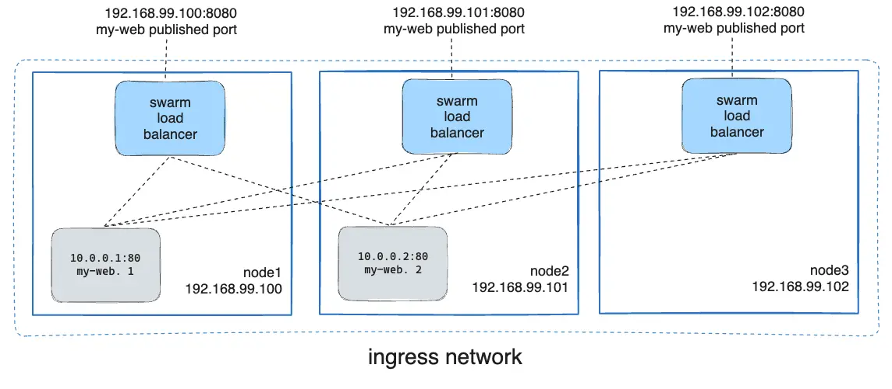

# VMs with Multipass for Swarm

[Multipass Tutorial](https://canonical.com/multipass/docs/tutorial)

## Launch VMs with docker installed

```bash
$ multipass launch docker --name docker-dev1
$ multipass launch docker --name docker-dev2
$ multipass launch docker --name docker-dev3
```

## Init a swarm

```bash
$ multipass shell docker-dev1
ubuntu@docker-dev1:~$ docker swarm init
Swarm initialized: current node (beutzvayxm2nvpt9nuyebbjvr) is now a manager.

To add a worker to this swarm, run the following command:

    docker swarm join --token SWMTKN-1-519c32yx7z3zjv8er1pv0g7516rq524qxwis0406mahcostt6w-c7gm2botk4bjoxa7cfvaabor9 192.168.64.5:2377

To add a manager to this swarm, run 'docker swarm join-token manager' and follow the instructions.

ubuntu@docker-dev1:~$ docker swarm join-token manager
To add a manager to this swarm, run the following command:

    docker swarm join --token SWMTKN-1-519c32yx7z3zjv8er1pv0g7516rq524qxwis0406mahcostt6w-4s8sgjr1nno2dexldyig0zmgg 192.168.64.5:2377
ubuntu@docker-dev1:~$ exit
$ multipass shell docker-dev2
ubuntu@docker-dev2:~$ docker swarm join --token SWMTKN-1-519c32yx7z3zjv8er1pv0g7516rq524qxwis0406mahcostt6w-4s8sgjr1nno2dexldyig0zmgg 192.168.64.5:2377
ubuntu@docker-dev1:~$ exit
$ multipass shell docker-dev3
ubuntu@docker-dev3:~$ docker swarm join --token SWMTKN-1-519c32yx7z3zjv8er1pv0g7516rq524qxwis0406mahcostt6w-4s8sgjr1nno2dexldyig0zmgg 192.168.64.5:2377
```

## Create an overlay network

```bash
ubuntu@docker-dev1:~$ docker network create --driver overlay mydrupal
ubuntu@docker-dev1:~$ docker service create --name psql --network mydrupal -e POSTGRES_PASSWORD=mydrupal postgres:14
ubuntu@docker-dev1:~$ docker service create --name drupal --network mydrupal -p 80:80 drupal:9
```

## Routing Mesh

> All nodes participate in an ingress routing mesh. The routing mesh enables each node in the swarm to accept connections on published ports for any service running in the swarm, even if there's no task running on the node. The routing mesh routes all incoming requests to published ports on available nodes to an active container.

```bash
$ docker service create \
  --name my-web \
  --publish published=8080,target=80 \
  --replicas 2 \
  nginx
```

