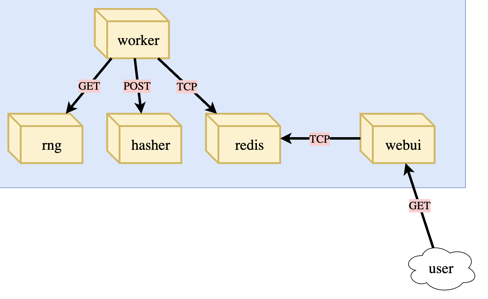
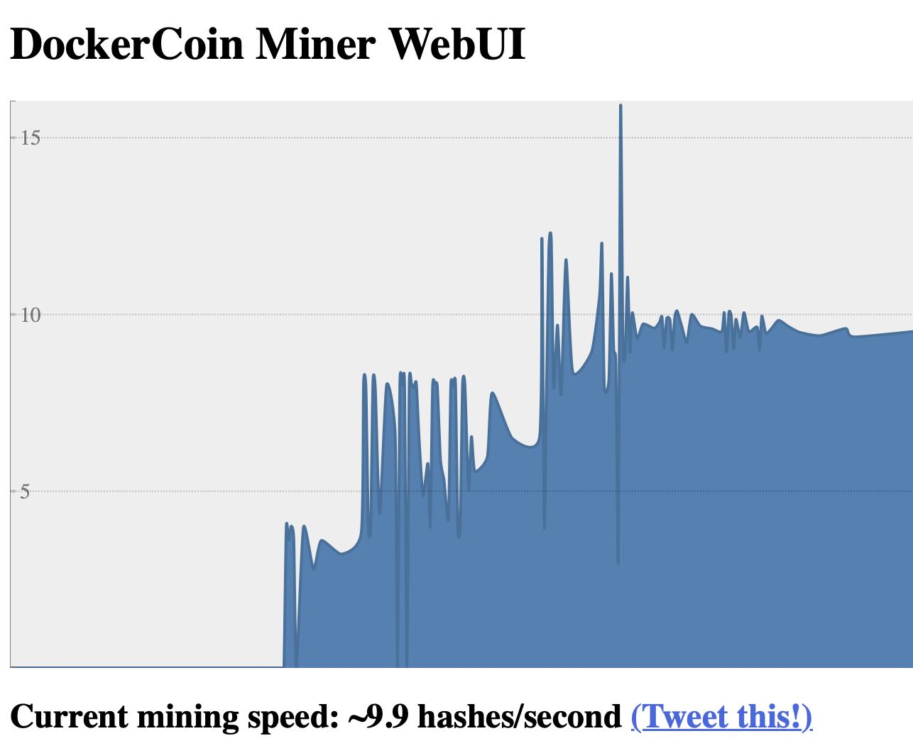

# What and Why Kubernetes

## Container Orchestrator

- Schedule running of containers on servers
- Dispatch them across many nodes
- Monitor and react to container and server health
- Provide storage, networking, proxy, security and logging features
- Do all in declarative way, rather than imperative
- Provide APIs to allow extensibility and management

### Kubernetes Distributions

- Kubernetes "vanilla upstream": pure k8s project source codes
- Cloud-managed: AKS, GKE, EKS, ...
- Self-managed: Red-Hat OpenShift, Docker Enterprise, Rancher, ...
- Vanilla installers: kubeadm, kops, kubicorn, ... 


# Kubernetes Architecture

## K8s Nodes

- The nodes executing containers run
  - a container engine (Docker, ...)
  - kubelet (node agent), to interact with Control plane's API
  - kube-proxy (for network management)
- Nodes are called "minions"

## K8s Control Plane (master nodes)

- Core k8s logic:
  - the API server
  - core services: controller manager, scheduler, ..
  - etcd - the database of k8s - a highly available key/value store
- The Master can/should be run on multible nodes, with high-availbility

# Concepts

## Pod

- Pod is an abstraction, not a binary for deployment, around multiple containers in k8s
- Pod is the lowest deployable unit in k8s
- IP addresses are associated to Pods, not the containers
- Containers in a Pod share "**localhost**", and volumes

# Kubectl

## First contact with

```sh
$ kubectl get node -o wide
NAME       STATUS   ROLES           AGE    VERSION   INTERNAL-IP    EXTERNAL-IP   OS-IMAGE             KERNEL-VERSION    CONTAINER-RUNTIME
minikube   Ready    control-plane   106d   v1.31.0   192.168.49.2   <none>        Ubuntu 22.04.4 LTS   6.12.5-linuxkit   docker://27.2.0

$ kubectl get node -o json | jq -r ".items[] | {name:.metadata.name} + .status.capacity"
{
  "name": "minikube",
  "cpu": "8",
  "ephemeral-storage": "76580740Ki",
  "hugepages-1Gi": "0",
  "hugepages-2Mi": "0",
  "hugepages-32Mi": "0",
  "hugepages-64Ki": "0",
  "memory": "8025252Ki",
  "pods": "110"
}

$ kubectl describle node/minikube
Name:               minikube
Roles:              control-plane
Labels:             beta.kubernetes.io/arch=arm64
...
PodCIDR:                      10.244.0.0/24
PodCIDRs:                     10.244.0.0/24
Non-terminated Pods:          (7 in total)
  Namespace                   Name                                CPU Requests  CPU Limits  Memory Requests  Memory Limits  Age
  ---------                   ----                                ------------  ----------  ---------------  -------------  ---
  kube-system                 coredns-6f6b679f8f-48j6h            100m (1%)     0 (0%)      70Mi (0%)        170Mi (2%)     106d
  kube-system                 etcd-minikube                       100m (1%)     0 (0%)      100Mi (1%)       0 (0%)         106d
  kube-system                 kube-apiserver-minikube             250m (3%)     0 (0%)      0 (0%)           0 (0%)         106d
  kube-system                 kube-controller-manager-minikube    200m (2%)     0 (0%)      0 (0%)           0 (0%)         106d
  kube-system                 kube-proxy-xcbtc                    0 (0%)        0 (0%)      0 (0%)           0 (0%)         106d
  kube-system                 kube-scheduler-minikube             100m (1%)     0 (0%)      0 (0%)           0 (0%)         106d
  kube-system                 storage-provisioner                 0 (0%)        0 (0%)      0 (0%)           0 (0%)         106d
Allocated resources:
  (Total limits may be over 100 percent, i.e., overcommitted.)
  Resource           Requests    Limits
  --------           --------    ------
  cpu                750m (9%)   0 (0%)
  memory             170Mi (2%)  170Mi (2%)
```

## Resource types


```sh
$ kubectl api-resources
kubectl api-resources
NAME                                SHORTNAMES   APIVERSION                        NAMESPACED   KIND
bindings                                         v1                                true         Binding
componentstatuses                   cs           v1                                false        ComponentStatus
configmaps                          cm           v1                                true         ConfigMap
endpoints                           ep           v1                                true         Endpoints
events                              ev           v1                                true         Event
limitranges                         limits       v1                                true         LimitRange
namespaces                          ns           v1                                false        Namespace
nodes                               no           v1                                false        Node
```

## Namespaces

```sh
$ kubectl get namespaces
NAME              STATUS   AGE
default           Active   106d
kube-node-lease   Active   106d
kube-public       Active   106d
kube-system       Active   106d

$ kubectl get pods
No resources found in default namespace.
$ kubectl get pods -A
NAMESPACE     NAME                               READY   STATUS    RESTARTS      AGE
kube-system   coredns-6f6b679f8f-48j6h           1/1     Running   4 (17h ago)   106d
kube-system   etcd-minikube                      1/1     Running   4 (17h ago)   106d
kube-system   kube-apiserver-minikube            1/1     Running   4 (17h ago)   106d
kube-system   kube-controller-manager-minikube   1/1     Running   5 (17h ago)   106d
kube-system   kube-proxy-xcbtc                   1/1     Running   4 (17h ago)   106d
kube-system   kube-scheduler-minikube            1/1     Running   4 (17h ago)   106d
kube-system   storage-provisioner                1/1     Running   9 (17h ago)   106d
```

### kube-public namespace


```sh
$ kubectl -n kube-public get pods
No resources found in kube-public namespace.
```

Nothing? The only interesting object in kube-public namespace is a ConfigMap named cluster-info

```sh
$ kubectl -n kube-public get configmaps
NAME               DATA   AGE
cluster-info       1      106d
kube-root-ca.crt   1      106d
$ kubectl -n kube-public describe configmap/cluster-info
Name:         cluster-info
Namespace:    kube-public
Labels:       <none>
Annotations:  <none>

Data
====
kubeconfig:
----
apiVersion: v1
clusters:
- cluster:
    certificate-authority-data: ....
    server: https://control-plane.minikube.internal:8443
  name: ""
contexts: null
current-context: ""
kind: Config
preferences: {}
```

# A first Deployment

```sh
$ kubectl create deployment pingpong --image alpine -- ping 1.1.1.1
deployment.apps/pingpong created

$ kubectl get all
NAME                           READY   STATUS    RESTARTS   AGE
pod/pingpong-6b7d4b7cb-gmhzg   1/1     Running   0          3m50s

NAME                 TYPE        CLUSTER-IP   EXTERNAL-IP   PORT(S)   AGE
service/kubernetes   ClusterIP   10.96.0.1    <none>        443/TCP   106d

NAME                       READY   UP-TO-DATE   AVAILABLE   AGE
deployment.apps/pingpong   1/1     1            1           3m50s

NAME                                 DESIRED   CURRENT   READY   AGE
replicaset.apps/pingpong-6b7d4b7cb   1         1         1       3m50s
```

## Get logs

```sh
$ kubectl logs deployments/pingpong
...
64 bytes from 1.1.1.1: seq=356 ttl=62 time=53.359 ms
64 bytes from 1.1.1.1: seq=357 ttl=62 time=46.724 ms
64 bytes from 1.1.1.1: seq=358 ttl=62 time=48.781 ms
```

Scale it up

```
$ kubectl scale deployment/pingpong --replicas=3
deployment.apps/pingpong scaled
$ kubectl get all
NAME                           READY   STATUS              RESTARTS   AGE
pod/pingpong-6b7d4b7cb-gm785   0/1     ContainerCreating   0          5s
pod/pingpong-6b7d4b7cb-gmhzg   1/1     Running             0          8m43s
pod/pingpong-6b7d4b7cb-s8zrh   1/1     Running             0          5s

NAME                 TYPE        CLUSTER-IP   EXTERNAL-IP   PORT(S)   AGE
service/kubernetes   ClusterIP   10.96.0.1    <none>        443/TCP   106d

NAME                       READY   UP-TO-DATE   AVAILABLE   AGE
deployment.apps/pingpong   2/3     3            2           8m43s

NAME                                 DESIRED   CURRENT   READY   AGE
replicaset.apps/pingpong-6b7d4b7cb   3         3         2       8m43s
(py11) ➜  udemy-fisher-k8s-mastery-handson git:(main) ✗ kubectl get all
NAME                           READY   STATUS    RESTARTS   AGE
pod/pingpong-6b7d4b7cb-gm785   1/1     Running   0          9s
pod/pingpong-6b7d4b7cb-gmhzg   1/1     Running   0          8m47s
pod/pingpong-6b7d4b7cb-s8zrh   1/1     Running   0          9s

NAME                 TYPE        CLUSTER-IP   EXTERNAL-IP   PORT(S)   AGE
service/kubernetes   ClusterIP   10.96.0.1    <none>        443/TCP   106d

NAME                       READY   UP-TO-DATE   AVAILABLE   AGE
deployment.apps/pingpong   3/3     3            3           8m47s

NAME                                 DESIRED   CURRENT   READY   AGE
replicaset.apps/pingpong-6b7d4b7cb   3         3         3       8m47s

$ kubectl logs deployments/pingpong
Found 3 pods, using pod/pingpong-6b7d4b7cb-gmhzg
PING 1.1.1.1 (1.1.1.1): 56 data bytes
64 bytes from 1.1.1.1: seq=0 ttl=62 time=45.420 ms
64 bytes from 1.1.1.1: seq=1 ttl=62 time=42.272 ms

$ kubectl logs pods/pingpong-6b7d4b7cb-gmhzg
PING 1.1.1.1 (1.1.1.1): 56 data bytes
64 bytes from 1.1.1.1: seq=0 ttl=62 time=45.420 ms
64 bytes from 1.1.1.1: seq=1 ttl=62 time=42.272 ms
...

$ kubectl logs pods/pingpong-6b7d4b7cb-gmhzg -f --tail 1
64 bytes from 1.1.1.1: seq=752 ttl=62 time=41.960 ms
64 bytes from 1.1.1.1: seq=753 ttl=62 time=42.377 ms
64 bytes from 1.1.1.1: seq=754 ttl=62 time=43.558 ms
```

## Manually delete a Pod from the deployment

```sh
$ kubectl delete pod/pingpong-6b7d4b7cb-gm785
pod "pingpong-6b7d4b7cb-gm785" deleted

# another bash terminal
$ kubectl get pods --watch
NAME                       READY   STATUS    RESTARTS   AGE
pingpong-6b7d4b7cb-gm785   1/1     Running   0          6m33s
pingpong-6b7d4b7cb-gmhzg   1/1     Running   0          15m
pingpong-6b7d4b7cb-s8zrh   1/1     Running   0          6m33s
pingpong-6b7d4b7cb-gm785   1/1     Terminating   0          7m37s
pingpong-6b7d4b7cb-7wgsb   0/1     Pending       0          0s
pingpong-6b7d4b7cb-7wgsb   0/1     Pending       0          0s
pingpong-6b7d4b7cb-7wgsb   0/1     ContainerCreating   0          0s
pingpong-6b7d4b7cb-7wgsb   1/1     Running             0          5s
```

# Cron Jobs and Resource Creation Options

## Create a cron job
```sh
$ kubectl create cronjob dummy-cron --schedule="*/3 * * * *" --restart=OnFailure --image=alpine -- sleep 10
```

## Streaming for logs

```sh
$ kubectl create deployment pingpong --replicas=8 --image alpine -- ping 1.1.1.1

$ kubectl logs -l app=pingpong --tail 1 -f
error: you are attempting to follow 8 log streams, but maximum allowed concurrency is 5, use --max-log-requests to increase the limit
```

## Better CLI logs with Stern

```sh
$ brew install stern
```


## Assignment 1
## Questions for this assignment
1. How many nodes does your cluster have?

```sh
$ kubectl get nodes
```


2. What kernel version and what container engine is each node running?

```sh
$ kubectl get nodes -o wide
NAME       STATUS   ROLES           AGE    VERSION   INTERNAL-IP    EXTERNAL-IP   OS-IMAGE             KERNEL-VERSION    CONTAINER-RUNTIME
minikube   Ready    control-plane   108d   v1.31.0   192.168.49.2   <none>        Ubuntu 22.04.4 LTS   6.12.5-linuxkit   docker://27.2.0
```

3. List only the pods in the kube-system namespace.

```sh
$ kubectl -n kube-system get pods
NAME                               READY   STATUS    RESTARTS        AGE
coredns-6f6b679f8f-48j6h           1/1     Running   4 (2d17h ago)   108d
etcd-minikube                      1/1     Running   4 (2d17h ago)   108d
kube-apiserver-minikube            1/1     Running   4 (2d17h ago)   108d
kube-controller-manager-minikube   1/1     Running   5 (2d17h ago)   108d
kube-proxy-xcbtc                   1/1     Running   4 (2d17h ago)   108d
kube-scheduler-minikube            1/1     Running   4 (2d17h ago)   108d
storage-provisioner                1/1     Running   9 (2d17h ago)   108d
```

4. Explain the role of some of these pods.

5. If there are few or no pods in kube-system, why could that be?

6. Create a deployment using kubectl create that runs the image bretfisher/clock and name it ticktock.

```sh
$ kubectl create deployment ticktock --image=bretfisher/clock
```

5. Increase the number of pods running in that deployment to three.

```sh
$ kubectl scale deployment/ticktock --replicas=3
```

6. Use a selector to output only the last line of logs of each container.

```sh
$ kubectl logs -l app=ticktock --tail 1
Sun Apr 20 08:01:29 UTC 2025
Sun Apr 20 08:01:29 UTC 2025
Sun Apr 20 08:01:28 UTC 2025
```

# k8s services

- a service is a stable address for a pod (or a bunch of pods)
- if we want to connect to our pods, we ne to create services
- CoreDNS allows to resolve services by names
- there are different types of services
  - ClusterIP
  - NodePort
  - LoadBalancer
  - ExternalName

## ClusterIP (default type)

- a virtual IP address is allocated for the service (internal, private within the cluster)
- reachable only from within the k8s cluster (nodes and pods)
- can connect to the service using the original port numbers

## NodePort

- a port is allocated for ther service (in the range of 30000-32768 by default)
- available on all nodes, and can be reachable from outside
- under the hood, a NodePort service routes traffic from external, targetting a same port on cluster nodes, to an internal ClusterIP service.

## LoadBalancer

- an external loadbalancer is allocated for the service
- it can be configured, eg. to route traffic to NodePort service on a set of cluster nodes.
- available only when the provider supports "load balancer as a service" (AWS, Azure, ..)

## ExternalName

- use to have an internal DNS name to route to some IP/name in ther external
- useful when the IP/name of the external service might change

## Labs

```sh
$ kubectl create deployment httpenv --image=betfisher/httpenv
deployment.apps/httpenv created
$ kubectl scale deployment/httpenv --replicas=10
$ kubectl set image deployment/httpenv httpenv=bretfisher/httpenv
$ kubectl get pods
NAME                       READY   STATUS    RESTARTS   AGE
httpenv-667d6dbfbc-4nzzp   1/1     Running   0          43s
httpenv-667d6dbfbc-4sctn   1/1     Running   0          43s
httpenv-667d6dbfbc-5j68d   1/1     Running   0          25s
httpenv-667d6dbfbc-6xs4d   1/1     Running   0          43s
httpenv-667d6dbfbc-9nb6x   1/1     Running   0          36s
httpenv-667d6dbfbc-dm4kn   1/1     Running   0          31s
httpenv-667d6dbfbc-hm6cb   1/1     Running   0          43s
httpenv-667d6dbfbc-jnzff   1/1     Running   0          43s
httpenv-667d6dbfbc-rftlw   1/1     Running   0          33s
httpenv-667d6dbfbc-w2tr6   1/1     Running   0          28s

$ kubectl expose deployment/httpenv --port 8888
service/httpenv exposed
$ kubectl get services
NAME         TYPE        CLUSTER-IP     EXTERNAL-IP   PORT(S)    AGE
httpenv      ClusterIP   10.105.10.99   <none>        8888/TCP   6s
kubernetes   ClusterIP   10.96.0.1      <none>        443/TCP    109d
```

Testing it

1. deploy some tools

```sh
$ kubectl apply -f https://bret.run/shpod.yml
```

2. Attach a shell TTY to the pod

```sh
$ kubectl attach --namespace=shpod -ti shpod
If you don't see a command prompt, try pressing enter.
$ IP=$(kubectl get service httpenv -o go-template --template '{{ .spec.clusterIP }}') ; echo $IP
10.105.10.99
$ curl http://$IP:8888
{"HOME":"/root","HOSTNAME":"httpenv-667d6dbfbc-jnzff","KUBERNETES_PORT":"tcp://10.96.0.1:443","KUBERNETES_PORT_443_TCP":"tcp://10.96.0.1:443","KUBERNETES_PORT_443_TCP_ADDR":"10.96.0.1","KUBERNETES_PORT_443_TCP_PORT":"443","KUBERNETES_PORT_443_TCP_PROTO":"tcp","KUBERNETES_SERVICE_HOST":"10.96.0.1","KUBERNETES_SERVICE_PORT":"443","KUBERNETES_SERVICE_PORT_HTTPS":"443","PATH":"/usr/local/sbin:/usr/local/bin:/usr/sbin:/usr/bin:/sbin:/bin"}
$ curl -s http://$IP:8888/ | jq -r .HOSTNAME
httpenv-667d6dbfbc-4nzzp
```

# k8s Network Model

- all nodes must be able to reach each other, without NAT
- all pods must be able to reach each other, without NAT
- pods and nodes must be able reach each other, without NAT
- each pod is ware of its IP addr
- pod IP addresses are assigned by the network implementation

## The Good

- everything can reach everything
- no NAT
- the specification is simple to allow various implementation

## The Less Good

- everything can reach everything
  - need network policies for security
- too many implementations
- kube-proxy is on the data path when connecting to a pod or container, and can slow the traffic.

## Assignment 2

1. Create a deployment called littletomcat using the tomcat image.

```sh
$ kubectl create deployment littletomcat --image=tomcat
```

2. What command will help you get the IP address of that Tomcat server?

```
$ kubectl get pods -o go-template --template '{{range .items}} {{ .status.podIP }} {{end}}'
 10.244.0.117
```

3. What steps would you take to ping it from another container?

```sh
$ kubectl apply -f https://bret.run/shpod.yml
namespace/shpod created
serviceaccount/shpod created
clusterrolebinding.rbac.authorization.k8s.io/shpod created
pod/shpod created
$ kubectl attach --namespace=shpod -ti shpod
If you don't see a command prompt, try pressing enter.
$ ping 10.244.0.117
PING 10.244.0.117 (10.244.0.117) 56(84) bytes of data.
64 bytes from 10.244.0.117: icmp_seq=1 ttl=64 time=1.60 ms
64 bytes from 10.244.0.117: icmp_seq=2 ttl=64 time=0.142 ms
64 bytes from 10.244.0.117: icmp_seq=3 ttl=64 time=0.089 ms
^C
--- 10.244.0.117 ping statistics ---
3 packets transmitted, 3 received, 0% packet loss, time 2043ms
rtt min/avg/max/mdev = 0.089/0.610/1.600/0.700 ms
[0.0.0.0] (shpod:N/A) k8s@shpod ~
```

4. What command would delete the running pod inside that deployment?

```sh
$ kubectl delete pod/littletomcat-6b5967d9c-fjbq7
pod "littletomcat-6b5967d9c-fjbq7" deleted
```

5. What happens if we delete the pod that holds Tomcat, while the ping is running?

The ping command hangs

6. What command can give our Tomcat server a stable DNS name and IP address?

```sh
$ kubectl expose deployment/littletomcat --port 8080
```

7. What commands would you run to curl Tomcat with that DNS address?

```sh
$ kubectl attach --namespace=shpod -ti shpod
If you don't see a command prompt, try pressing enter.
$ IP=$(kubectl get service littletomcat -o go-template --template '{{ .spec.clusterIP }}') ; echo $IP
$ curl http://$IP:8080
<!doctype html><html lang="en"><head><title>HTTP Status 404 – Not Found</title><style type="text/css">body {font-family:Tahoma,Arial,sans-serif;} h1, h2, h3, b {color:white;background-color:#525D76;} h1 {font-size:22px;} h2 {font-size:16px;} h3 {font-size:14px;} p {font-size:12px;} a {color:black;} .line {height:1px;background-color:#525D76;border:none;}</style></head><body><h1>HTTP Status 404 – Not Found</h1><hr class="line" /><p><b>Type</b> Status Report</p><p><b>Description</b> The origin server did not find a current representation for the target resource or is not willing to disclose that one exists.</p><hr class="line" /><h3>Apache Tomcat/11.0.6</h3></body></html>[0.0.0.0] (shpod:N/A) k8s@shpod ~
$ nslookup 10.107.191.92
Server:		10.96.0.10
Address:	10.96.0.10:53

92.191.107.10.in-addr.arpa	name = littletomcat.default.svc.cluster.local

$ curl -s http://littletomcat.default.svc.cluster.local:8080
<!doctype html><html lang="en"><head><title>HTTP Status 404 – Not Found</title><style type="text/css">body {font-family:Tahoma,Arial,sans-serif;} h1, h2, h3, b {color:white;background-color:#525D76;} h1 {font-size:22px;} h2 {font-size:16px;} h3 {font-size:14px;} p {font-size:12px;} a {color:black;} .line {height:1px;background-color:#525D76;border:none;}</style></head><body><h1>HTTP Status 404 – Not Found</h1><hr class="line" /><p><b>Type</b> Status Report</p><p><b>Description</b> The origin server did not find a current representation for the target resource or is not willing to disclose that one exists.</p><hr class="line" /><h3>Apache Tomcat/11.0.6</h3></body></html>[0.0.0.0] (shpod:N/A) k8s@shpod ~
```

8. If we delete the pod that holds Tomcat, does the IP address still work? How could we test that?

```sh
$ kubectl get pods -o go-template --template '{{range .items}} {{ .status.podIP }} {{end}}'
 10.244.0.119

$ kubectl delete pod/littletomcat-6b5967d9c-2jdjq
pod "littletomcat-6b5967d9c-2jdjq" deleted

$ curl -s http://littletomcat.default.svc.cluster.local:8080
<!doctype html><html lang="en"><head><title>HTTP Status 404 – Not Found</title><style type="text/css">body {font-family:Tahoma,Arial,sans-serif;} h1, h2, h3, b {color:white;background-color:#525D76;} h1 {font-size:22px;} h2 {font-size:16px;} h3 {font-size:14px;} p {font-size:12px;} a {color:black;} .line {height:1px;background-color:#525D76;border:none;}</style></head><body><h1>HTTP Status 404 – Not Found</h1><hr class="line" /><p><b>Type</b> Status Report</p><p><b>Description</b> The origin server did not find a current representation for the target resource or is not willing to disclose that one exists.</p><hr class="line" /><h3>Apache Tomcat/11.0.6</h3></body></html>[0.0.0.0] (shpod:N/A) k8s@shpod ~

```

# DockerCoins Application



- **worker** loops on
  - **worker** invokes **rng** service to generate random bytes
  - **worker** invokes **hasher** to hash these bytes
- every second, **worker** updates **redis** to indicate how many loops were done
- **webui** queries **redis**, computes and displays "hashing speed"

## Deploy on k8s

```sh
$ kubectl create deployment redis --image=redis
$ kubectl create deployment rng --image=dockercoins/rng:v0.1
$ kubectl create deployment hasher --image=dockercoins/hasher:v0.1
$ kubectl create deployment webui --image=dockercoins/webui:v0.1
$ kubectl create deployment worker --image=dockercoins/worker:v0.1
```

Worker crashes as it need to call to rng, hasher, redis

```sh
$ kubectl expose deployment/redis --port 6379
$ kubectl expose deployment/rng --port 80
$ kubectl expose deployment/hasher --port 80
```

## Expose the DockerCoins

```sh
$ kubectl expose deployment/webui --type=NodePort --port=80
```

Tunnel with minikube

```sh
$ minikube service webui
|-----------|-------|-------------|---------------------------|
| NAMESPACE | NAME  | TARGET PORT |            URL            |
|-----------|-------|-------------|---------------------------|
| default   | webui |          80 | http://192.168.49.2:32567 |
|-----------|-------|-------------|---------------------------|
🏃  Starting tunnel for service webui.
|-----------|-------|-------------|------------------------|
| NAMESPACE | NAME  | TARGET PORT |          URL           |
|-----------|-------|-------------|------------------------|
| default   | webui |             | http://127.0.0.1:65352 |
|-----------|-------|-------------|------------------------|
🎉  Opening service default/webui in default browser...
```

## Trying some tracffic investigation


```sh
$ kubectl scale deployment/worker --replicas=3
$ kubectl scale deployment/worker --replicas=10
```



```sh
$ kubectl apply -f https://bret.run/shpod.yml
```

2. Attach a shell TTY to the pod

```sh
$ kubectl attach --namespace=shpod -ti shpod

$ HASHER=$(kubectl get service/hasher -o go-template --template='{{ .spec.clusterIP }}')
$ RNG=$(kubectl get service/rng -o go-template --template='{{ .spec.clusterIP }}')
$ httping -c 3 $HASHER
PING 10.100.151.201:80 (/):
connected to 10.100.151.201:80 (210 bytes), seq=0 time=  1.55 ms
connected to 10.100.151.201:80 (210 bytes), seq=1 time=  3.47 ms
connected to 10.100.151.201:80 (210 bytes), seq=2 time=  1.47 ms
--- http://10.100.151.201/ ping statistics ---
3 connects, 3 ok, 0.00% failed, time 3013ms
round-trip min/avg/max = 1.5/2.2/3.5 ms
$ httping -c 3 $RNG
PING 10.103.27.23:80 (/):
connected to 10.103.27.23:80 (158 bytes), seq=0 time=773.94 ms
connected to 10.103.27.23:80 (158 bytes), seq=1 time=759.67 ms
connected to 10.103.27.23:80 (158 bytes), seq=2 time=999.04 ms
--- http://10.103.27.23/ ping statistics ---
3 connects, 3 ok, 0.00% failed, time 5536ms
round-trip min/avg/max = 759.7/844.2/999.0 ms
```

**rng** seems the bottleneck

## Assignment 3

Wordsmith has 3 components:
- a web frontend bretfisher/wordsmith-web
- an API backend bretfisher/wordsmith-api NOTE: previously called "words"
- a postgres DB bretfisher/wordsmith-db

These images have been built and pushed to Docker Hub. We want to deploy all 3 components on Kubernetes

- The web frontend listens on port 80
- The web frontend should be public (available on a high port from outside the cluster)
- The web frontend connects to the API at the address http://api:8080
- The API backend listens on port 8080
- The API connects to the database with the connection string pgsql://db:5432
- The database listens on port 5432


```sh
$ kubectl create deployment db --image=bretfisher/wordsmith-db
$ kubectl create deployment api --image=bretfisher/wordsmith-api
$ kubectl create deployment web --image=bretfisher/wordsmith-web
$ kubectl expose deployment/db --port=5432
$ kubectl expose deployment/api --port=8080
$ kubectl expose deployment/web --type=NodePort --port=80
$ kubectl scale deployment/api --replicas=5
```

# Shifting from CLI to YAML

```sh
$ kubectl apply -f ...yaml
```

## Security implications of applying YAML

"kubectl apply -f \<URL\>" is convenient but the resources can be evil
- start bitcoin miners
- hide in non-default namespaces
- bind-mounts nodes' filesystems
- insert SSH keys in the root account
- encrypt data and ransom it
- ...

Better to download and inspect the content before applying.

# DaemonSets

- we want to scale a service with exactly one and only one instance per node
- if we use deployment with --replicas=number_of_nodes, we cannot guarantee the instances are distributed evenly
- if we add nodes later, the deployment is not automatically scaled
- if we remove nodes, the killed pods will be restarted on the remaining nodes.

## Use cases

- kube-proxy is an example
- CNI network plugins
- monitoring agents
- hardware management tools

## Creating of a daemon set

- as of kubenetes 1.15, the CLI cannot create daemon sets.
- But any kind of resource can always be created by providing a YAML description

## Forcing Deployment -> DaemonSet

```
$ kubectl get deployment rng -o yaml > rng.yml
```

Edit to change **kind: DaemonSet** then force the apply

```sh
$ kubectl apply -f rng.yml --validate=false
```

## Labels and Selectors

By adding a new DaemonSet of rng, we can see on webui that the coin generation rate is higher -> Why as we did not expose the pod of the DaemonSet.


```sh
$ kubectl describe service/rng
Name:                     rng
Namespace:                default
Labels:                   app=rng
Annotations:              <none>
Selector:                 app=rng
Type:                     ClusterIP
IP Family Policy:         SingleStack
...
```

it means all pods having the label **app=rng**, eventhough they may have other labels too.

```sh
$ kubectl get pods -l app=rng
NAME                   READY   STATUS    RESTARTS   AGE
rng-65d8fc8cd6-bxr42   1/1     Running   0          15m
rng-wpb2q              1/1     Running   0          12m
```

# Resource Selectors

- If we remove a pod, from a deployment: k8s would recreate it immediately (by replica set or daemon set)
- What would happen if we removed the label "app=rng" from the pod: it would be recreated too.


```sh
$ kubectl apply -f dockercoins.yml
$ kubectl label pod/rng-65d8fc8cd6-62kp7 "app=test" --overwrite
$ kubectl get pods
NAME                      READY   STATUS    RESTARTS   AGE
...
rng-65d8fc8cd6-62kp7      1/1     Running   0          3m55s
rng-65d8fc8cd6-6xpr7      1/1     Running   0          100s
...
$ kubectl delete -f dockercoins.yml
$ kubectl get pods
NAME                   READY   STATUS    RESTARTS   AGE
rng-65d8fc8cd6-62kp7   1/1     Running   0          6m14s
$ kubectl delete pod/rng-65d8fc8cd6-62kp7
```

- the mission of a Replica Set is: make sure there is the right number of pods matching this spec
- the mission of a Daemon Set is: make sure that there is 1 pod matching this spec on each node.
- In fact, replica sets and daemon sets do not check pod specifications
  - they have a selector, and look for pods matching that selector

## Labels and Debugging

- When a pod is misbehaving, we can delete it then a new one will be created
- But we can just change its labels
  - it will be removed from the service (no matching service selector) and will stop receiving traffic
  - a new pod will be create to replace
  - the problematic pod stays for investigation

## Labels and advanced rollout control

- we can introduce a pod, by matching its labels with a service's selector
- this pod will receive and serve traffic
  - one-shot pod with all DEBUG flags to collect logs, then slide it out
  - fine-grain control of deployment/rollout updates


## Assignment 4

Objectives:
- We need to create two deployments: one for v1 (NGINX), another for v2 (Apache).
- They will be exposed through a single service.
- The **selector** of that service will need to match the pods created by *both* deployments.
- For that, we will need to change the deployment specification to add an extra label, to be used solely by the service.
- That label should be different from the pre-existing labels of our deployments, otherwise, our deployments will step on each other's toes.
- We're not at the point of writing our own YAML from scratch, so you'll need to use the kubectl edit command to modify existing resources.

Questions for this assignment
1. What commands did you use to perform the following?
   1. Create a deployment running one pod using the official NGINX image.
   
   ```sh
   $ kubectl create deployment web --image=nginx
   ```
   
   2. Expose that deployment with a ClusterIP service.

   ```sh
   $ kubectl expose deployment web --port=80
   ```

   3. Check that you can successfully connect to the exposed service.

   ```sh
   $ kubectl apply -f shpod.yml
   $ kubectl attach --namespace=shpod -ti shpod
   $ IP=$(kubectl get service web -o go-template --template '{{ .spec.clusterIP }}') ; echo $IP
    10.99.244.9
    [0.0.0.0] (shpod:N/A) k8s@shpod ~
   $ curl -s http://$IP:80
    <!DOCTYPE html>
    <html>
    <head>
    <title>Welcome to nginx!</title>
    <style>
    html { color-scheme: light dark; }
    body { width: 35em; margin: 0 auto;
    font-family: Tahoma, Verdana, Arial, sans-serif; }
    </style>
    </head>
    <body>
    <h1>Welcome to nginx!</h1>
    <p>If you see this page, the nginx web server is successfully installed and
    working. Further configuration is required.</p>

    <p>For online documentation and support please refer to
    <a href="http://nginx.org/">nginx.org</a>.<br/>
    Commercial support is available at
    <a href="http://nginx.com/">nginx.com</a>.</p>

    <p><em>Thank you for using nginx.</em></p>
    </body>
    </html>
   ```

1. What commands did you use to perform the following?
   1. Change (edit) the service definition to use a label/value of myapp: web
   
   ```sh
   $ kubectl edit service/web
    service/web edited
   ```
   
   2. Check that you cannot connect to the exposed service anymore.
   3. Change (edit) the deployment definition to add that label/value to the pod template.
   
   ```
   $ kubectl edit deployment/web

    template:
      metadata:
        creationTimestamp: null
        labels:
          app: web
          myapp: web
   ```
   4. Check that you *can* connect to the exposed service again.
2. What commands did you use to perform the following?
   1. Create a deployment running one pod using the official Apache image (httpd).
   
   ```sh
   $ kubectl create deployment apach --image=httpd
   ```
   
   2. Change (edit) the deployment definition to add the label/value picked previously.
   
   ```sh
   $ kubectl edit deployment/apach
    template:
      metadata:
        creationTimestamp: null
        labels:
          app: apach
          myapp: web
   ```
   
   3. Connect to the exposed service again.
    (It should now yield responses from both Apache and NGINX.)
   
   ```sh
    $ curl -s http://$IP:80
    <!DOCTYPE html>
    <html>
    <head>
    <title>Welcome to nginx!</title>
    <style>
    html { color-scheme: light dark; }
    body { width: 35em; margin: 0 auto;
    font-family: Tahoma, Verdana, Arial, sans-serif; }
    </style>
    </head>
    <body>
    <h1>Welcome to nginx!</h1>
    <p>If you see this page, the nginx web server is successfully installed and
    working. Further configuration is required.</p>

    <p>For online documentation and support please refer to
    <a href="http://nginx.org/">nginx.org</a>.<br/>
    Commercial support is available at
    <a href="http://nginx.com/">nginx.com</a>.</p>

    <p><em>Thank you for using nginx.</em></p>
    </body>
    </html>
    [0.0.0.0] (shpod:N/A) k8s@shpod ~
    $ curl -s http://$IP:80
    <html><body><h1>It works!</h1></body></html>
    [0.0.0.0] (shpod:N/A) k8s@shpod ~
    $
   ```
   
# All about k8s YAML

k8s API server accept YAML.

- YAML is a superset of JSON
- Identation agnostic
- Key concepts in practice:
  - Key/Value pairs
  - Array/Lists
  - Dictionaries/Maps

## Basic parts of any k8s resource manifests

- each file contains one or more nanifests
- each manifest describes an API object (deployment, service, ...)
- each manifest needs 4 parts:
  - apiVersion
  - kind
  - metadata
  - spec
- manifests in 1 YAML file have to be separated by a line of 3-dashs "---"

## We do not have to start from scratch

- create a resouce with CLI
- dump it in YAML format: **kubectl get ... -o yaml**
- re-customize the YAML file
- use it for kubectl apply

we can make dry run to not create resources:

```sh
$ kubectl create deployment web --image nginx -o yaml --dry-run
apiVersion: apps/v1
kind: Deployment
metadata:
  creationTimestamp: null
  labels:
    app: web
  name: web
spec:
  replicas: 1
  selector:
    matchLabels:
      app: web
  strategy: {}
  template:
    metadata:
      creationTimestamp: null
      labels:
        app: web
    spec:
      containers:
      - image: nginx
        name: nginx
        resources: {}
status: {}
```

## YAML from scratch

Each manifest has 4 parts:

```yaml
apiVersion: # find with 'kubectl api-resources' for the kind
kind: # find with 'kubectl api-resources'
metadata:
spec: # find with 'kubectl explain <kind>.spec --recursive'
```

## YAML tips

# Validating k8s changes

## Server dry run

- ```--dry-run``` does not really make a run

example


```sh
$ kubectl create deployment web --image nginx -o yaml > web.yml
```
edit and modify ```kind: DaemonSet``` then

```sh
$ kubectl apply -f web.yml --dry-run --validate=false -o yaml
...
spec:
  progressDeadlineSeconds: 600
  replicas: 1
  revisionHistoryLimit: 10
...
```
this is not valid for DaemonSet.

We can do better with ```--dry-run=server```

```
$ kubectl apply -f web.yml --dry-run=server --validate=false -o yaml
apiVersion: apps/v1
kind: DaemonSet
metadata:
...
spec:
  revisionHistoryLimit: 10
  selector:
    matchLabels:
      app: web
...
```

- The yaml file is verified much more extensively.
- The only skipped step is the "write to etcd"
- YAML file that passes server dry-run should be applied successfully.
- k8s server can be even different from cli (kubectl) version.

## kubectl diff

It's a server dry-run and diff

```sh
$ kubectl diff -f just-a-pod.yaml
diff -u -N /var/folders/6h/15ndlbdd5jl8rr8hqbhn5zz40000gn/T/LIVE-2553161469/v1.Pod.default.hello /var/folders/6h/15ndlbdd5jl8rr8hqbhn5zz40000gn/T/MERGED-1522656310/v1.Pod.default.hello
--- /var/folders/6h/15ndlbdd5jl8rr8hqbhn5zz40000gn/T/LIVE-2553161469/v1.Pod.default.hello	2025-04-22 23:20:03
+++ /var/folders/6h/15ndlbdd5jl8rr8hqbhn5zz40000gn/T/MERGED-1522656310/v1.Pod.default.hello	2025-04-22 23:20:03
@@ -11,7 +11,7 @@
   uid: 298ce1cc-2053-47e7-98a7-f86ecc302628
 spec:
   containers:
-  - image: nginx
+  - image: nginx:1.17
     imagePullPolicy: Always
     name: hello
     resources: {}
```

# Rolling Updates and Failure Recovery

With rolling update, when a Deployment is updated

- the Deployment can control multiple ReplicaSets
- each ReplicaSet is a group of identical Pods
- during the update, we have at least 2 ReplicaSets
  - the "new" set, for the target version
  - one or more "old" set, for the pods to turn down
- 2 parameters determine the pace of rolling out: ```maxUnavailable``` and ```maxSurge```
  - they can be absolute numbers of pods, or percentages of the replicas counts
  - at any given time
    - there will always be at least ```replicas - maxUnavailable``` pods available
    - there will never be more than ```replicas + maxSurge``` pods in total
    - therefore there will be up to ```maxUnavailable + maxSurge``` pods being updated
- 

## Recovering from failed updates

```sh
$ kubectl apply -f dockercoins.yaml
$ kubectl set image deployment/worker worker=dockercoins/worker:v0.3
$ kubectl rollout status deployment/worker
Waiting for deployment "worker" rollout to finish: 5 out of 10 new replicas have been updated...
$ describe deployment/worker
Name:                   worker
Namespace:              default
CreationTimestamp:      Thu, 24 Apr 2025 22:58:26 +0700
Labels:                 app=worker
Annotations:            deployment.kubernetes.io/revision: 2
Selector:               app=worker
Replicas:               10 desired | 5 updated | 13 total | 8 available | 5 unavailable
StrategyType:           RollingUpdate
MinReadySeconds:        0
RollingUpdateStrategy:  25% max unavailable, 25% max surge

$ kubectl rollout undo deployment/worker
deployment.apps/worker rolled back
$ kubectl rollout status deployment/worker
deployment "worker" successfully rolled out
$ kubectl get pods
NAME                      READY   STATUS    RESTARTS   AGE
hasher-99bbd4bb-zp5t7     1/1     Running   0          19m
redis-7b47f84cc4-thccp    1/1     Running   0          19m
rng-65d885d498-6mx9z      1/1     Running   0          19m
webui-74bb6bbc59-jwscs    1/1     Running   0          19m
worker-5c6f84b477-26tbt   1/1     Running   0          19m
worker-5c6f84b477-694mf   1/1     Running   0          22s
worker-5c6f84b477-6vsnb   1/1     Running   0          19m
worker-5c6f84b477-cxdfg   1/1     Running   0          19m
worker-5c6f84b477-ksfft   1/1     Running   0          22s
worker-5c6f84b477-lgb6x   1/1     Running   0          19m
worker-5c6f84b477-njjf9   1/1     Running   0          19m
worker-5c6f84b477-npmxx   1/1     Running   0          19m
worker-5c6f84b477-prsvf   1/1     Running   0          19m
worker-5c6f84b477-vg5f7   1/1     Running   0          19m
```

# Rollout History

```sh
$ kubectl rollout history deployment/worker
deployment.apps/worker
REVISION  CHANGE-CAUSE
2         <none>
3         <none>
$ kubectl describe replicasets -l app=worker | grep -A4 Annotations
Annotations:    deployment.kubernetes.io/desired-replicas: 10
                deployment.kubernetes.io/max-replicas: 13
                deployment.kubernetes.io/revision: 3
                deployment.kubernetes.io/revision-history: 1
Controlled By:  Deployment/worker
--
Annotations:    deployment.kubernetes.io/desired-replicas: 10
                deployment.kubernetes.io/max-replicas: 13
                deployment.kubernetes.io/revision: 2
Controlled By:  Deployment/worker

$ kubectl rollout undo deployment/worker --to-revision=3
```

# Healthchecks and Prob types

## Healthcheck basics

- Healthchecks are key for ```lifecycle automation```
- Healthchecks are probes that are applied to Containers (not Pods)
- Kubernetes will take action on containers that fail healthchecks
- each container has 3 optional probes
  - liveness: dead or alive - this is the most important probe
  - readiness: ready to serve traffic - only needed for a service
  - startup: still starting up
- different probe handers are available.
- they do not replace the full mornitoring solution

### Liveness
- indicates a container is dead or alive
- a dead container cannot come back
- if liveness probe fails, the container will be killed
- what happens next depends on the pod's ```restartPolicy```
  - ```Never```: the container is not restarted
  - ```OnFailure``` or ```Always```: the container is restarted
- When to use a liveness probe
  - anything when our incident response would be "just restart it"
  - otherwise, we just restart the pod for no reason

### Readiness

- indicates if the container is ready to serve a traffic
- a container that is "unready" can become "ready" again
- if the readiness probe fails
  - the container is not killed
  - the pod is temporarilly romoved from a service and re-added as soon as the readiness probe passes again
- when to use readiness probe
  - to indicate failure due to an external cause
    - db is not reachable
    - mandatory services (auth, ...) are unavailable
  - to indicate temporary failure
    - runtime is busy
    - application can only serve N parallel connections

### Startup probe

- ```startupProbe``` is used to indicate "container not ready yet"
  - process is starting
  - loading external data, cache
- it is better to used and tor replace the use of parameter ```initialDelaySecond```

## Probe types and examples

### Benefits of using probes

- rolling updates proceed when containers are in ready state (not just started)
- containers in a broken state get killed and restarted
- containers not in ready state is removed from loadbalancer rotation

### different types of probe handlers

- HTTP request
  - specify URL of the request (and optional headers)
  - any status code of 200-399 is considered as success
- TCP connection
  - probe succeeds if TCP port is open
- arbitrary exec (it can be a bit expensive)
  - a command is executed in the container
  - a status code 0 indicates success

### Timing and Thresholds

- probes are executed at time intervals of ```periodSeconds``` (default 10s)
- the timeout for a probe is set with ```timeoutSeconds``` (default 1s): if probe takes longer than that, it's considered as a FAIL
- a probe is considered successful after ```successThreshold``` successes (default 10 times)
- a probe is considered failing after ```failureThreshold``` FAILs (default 3)
- a probe can have an ```initialDelaySeconds``` parameter (default 0): kubernetes will wait that amount of seconds before running the probe for the first time.

### Proper healthcheck usage

- if a web server depends on a database, and the database is down:
  - liveness probe should succeed
  - readiness probe should fail
- same thing for any hard dependency (the container cannot work without it): donot fail the liveness, but the readiness
- HTTP/TCP probe cannot check the external system: but we can make a http endpoint with some codes to validate the external dependency
- Healthcheck for workers (job without incoming connection)
  - readiness is NOT useful
  - liveness may help to restart it, but how to check?
  - embedding an HTTP endpoint for that check is an option (but a bit expensive)
  - using a ```lease``` file can be easier
    - touch a file during each iteration of the main loop
    - probe check the timestamp of that file from an exec probe
  - writing logs (OK status with timestamps)

### Questions to create healthchecks

- do we need liveness, readiness or both?
- do we have existing HTTP endpoint?
- do we need to add new endpoints or something else?
- are the healthchecks using resources and likely to slow down the app?
- do they depends on additional service?

# Update Dockercoins with Probes and Testing

## Questions first

- Do we need liveness, readiness?
  - liveness: yes, we always need it
  - readiness: to see
- Do we have HTTP endpoints?
  - 3 services (```hasher, rng, webui```) have trivial route at ```/```
  - These routes do NOT seem complex or expensive. do Not seem to call external services

## A simple HTTP liveness probe

```yaml
containers:
  - name: ...
    image: ...
    livenessProbe:
      httpGet:
        path: /
        port: 80
      inittialDelaySeconds: 30 # long enough?
      periodSeconds: 5
```

- this will give 30 seconds to the container to start
- run probe every 5 seconds
- default timeout is 1 second
- will consider container as Dead after 3 failed attempts
- will consider alive after 1 successful attempt

## Making better healthchecks

With the ```rng``` example:
- 1 pod can only handle 100ms to generate 1 tokens: 10/seconds for max
- the probe expects to have 1s tiemout response
- the traffic is more that 10 requests/s it will likely fail the probe

Discussion
- the liveness probe depends on backend workload
- when the liveness fails (3 times), the container is restarted
  - the less capacity the application has during restart
  - the more likely other pods fail the probe
- So: it is not a good healthcheck solution

# Managing App Configurations

## Managing App Config

- Apps used to need to be configured
- There are many ways to pickup configurations
  - command-line arguments
  - environment vars
  - config files
  - config servers (from db, config API)
- Passing config to a container
  - baking into a customer image
  - command-line arguments
  - env vars
  - injecting config files
  - exposing it over a k8s API
  - config servers

## App config options

### Baking config into docker image

- Put config files, env vars, ... into the container image
- Easy and simple
- But
  - multiplication of images
  - different images for dev/staging/prod
- Should avoid it except for quick trial

### Command-line arguments

- pass options to arguments of the container command specs
- good to use when there aren't many arguments
- not ideal to deal with default values

### Env variables

- pass through the env map in the container spec
- values must be string: should be quoted for numbers
- env variables will not change after container start

### Kubernetes downward API

- Exposing Pod's IP address
  ```
  - name: MY_POD_IP
    valueFrom:
      fieldRef:
        fieldPath: status.podIP
  ```

### Env vars vs ConfigMaps

ConfigMap
- we need to inject a full config file
- ConfigMap is a k8s resource existing in the namespace
- It's a key/value map
- for config files
  - key: filename
  - value: string as content
  ```sh
  kubectl create configmap my-app-config --from-file=app.conf
  # or with multiple keys (one per file in directory)
  kubectl create configmap my-app-config --from-file=confif_dir/
  ```
- for individual parameters
  - key: name of param
  - value: value
  ```sh
  kubectl create configmap my-app-config \
    --from-literal=background=blue\
    --from-literal=foreground=red
  ```

# Creating and Using ConfigMaps and Secrets

## Exposing ConfigMaps to containers

- ConfigMap can be exposed as plain files in the filesystem of a container
  - declaring volume and mounting it
  - effective for ConfigMaps containing whole files
- ConfigMap can be exposed as env variables in containers
  - achived with Downward API
  - effective for ConfigMaps containing individual params

## Passing a config file with a ConfigMap

- example with HAProxy
- it expects a configuration file in ```/usr/local/etc/haproxy/haproxy.cfg```

## ConfigMaps + Downward API

```sh
$ kubectl create configmap resgistry --from-literal=http.addr=0.0.0.0:80
$ kubectl get configmap/registry -o wide
```

## K8s secret

- it works almost the same as ConfigMap
- it's only more secure, to store credentials, paswwords, ..
- it's encrypted only at rest (on disk)

# Kubernetes Ingress

## Why Ingress

- we can expose access to pods via services
- Services to expose to the outside can be
  - NodePort
  - LoadBalancer (allocated externally, routing to a NodePort)
- What about HTTP services
  - we can build ourown reverse proxy
- Ingress (not ingress)
  - is a k8s resource
  - specific to HTTP(S)

## What make up Kubernetes Ingress

- kubernetes API resource (kubectl get ingres/...)
- designed to expose HTTP(s) services
- basisc:
  - load balancing
  - SSL termination
  - name-based virtual hosting

### Principle of operation

- Step 1: deploy as ```Ingress controller```
  - Ingress Controller = load balancing proxy + control loop
- Step 2: set up DNS
  - associate external DNS entries with the load balancer
- Step 3: create Ingress resources for our Service resources
  - rules for handling HTTP/S connections
  - the Ingress controller picks up these resources and config the LB


### Planning for Ingress Controller

- Many options to deploy an Ingress Controller
  -  NGINX, ...
-  For DNS
   -  different options too
   -  we can use ```nip.io```
-  We will create Ingress resources for various HTTP services

# Deploying NGINX and Ingress resources

## Deploying NGINX Ingress Controller

- we need the template from kubernetes/ingress-nginx project
- the 2 main sections are
  - NGINX Deployment (or DaemonSet) and all its required resources
    - namespace
    - ConfigMaps (storing NGINX configs)
    - ServiceAccount (authentication to k9s API)
    - Role/ClusterRole/RoleBindings (authorization to API parts)
    - LimitRange (limit cpu/memory of NGINX)
  - Service to expose NGINX on ports 80/443
    - different for each k8s distribution

## Creating Ingress resources

```sh
kubectl create deployment cheddar --image=bretfisher/cheese:cheddar
kubectl create deployment stilton --image=bretfisher/cheese:stilton
kubectl create deployment wensleydale --image=bretfisher/cheese:wensleydale

kubectl expose deployment/cheddar --port 80
kubectl expose deployment/stilton --port 80
kubectl expose deployment/wensleydale --port 80
```

