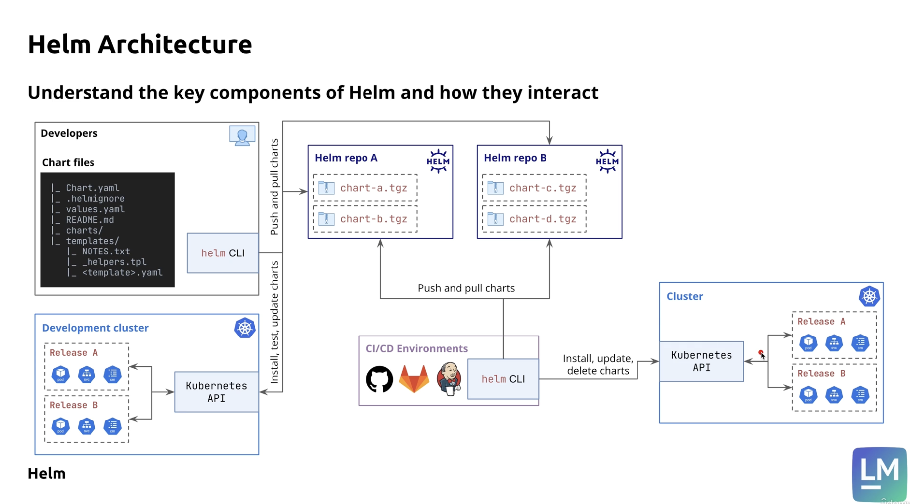

# What is Helm

## Helm and k8s

Deploying applications with just K8s is challenging

- complexity of resource management: multiple resources with dependancies
- manual Yaml edits expose to syntax issues, inconsistencies
- duplication of repetitive Yaml configurations.
- version control of the whole application is very hard

Helm provides

- a package manager for k8s, akin apt for Ubuntu, yum for Redhat
  - it allows to define, install and upgrade applications containing multiple k8s resources with a single command
- with Helm
  - we can package multiple k8s manifests (templates) into a single chart
  - deploy, update and manage all the manifests from a chart with a single command
  - customize the templates with Go templating features and custom value files
  - resable charts either publicly or privately
  - leverage charts for the versioning of the applications

### Helm limitations

- over templating can lead to hart-to-maitain charts
- reuse of community charts can expose to security threats

## Helm vs Kustomize

## Helm architecture




# Helm fundamentals

## Chart repository
[ArtifactHub - Cloud Native packages](https://artifacthub.io/)

Add repo
```sh
$ helm repo add bitnami https://charts.bitnami.com/bitnami
$ help repo list
NAME                	URL
bitnami             	https://charts.bitnami.com/bitnami
```

Search package


```sh
$ helm search repo wordpress --versions
NAME                   	CHART VERSION	APP VERSION	DESCRIPTION
bitnami/wordpress      	24.2.1       	6.7.2      	WordPress is the world's most popular blogging ...
...
bitnami/wordpress      	24.1.9       	6.7.1      	WordPress is the world's most popular blogging ...
```

## Quick-start
### Install


```sh
$ helm install local-wp bitnami/wordpress --version=24.1.9
NAME: local-wp
LAST DEPLOYED: Sun Apr 13 15:07:04 2025
NAMESPACE: default
STATUS: deployed
REVISION: 1
TEST SUITE: None
NOTES:
CHART NAME: wordpress
CHART VERSION: 24.1.9
APP VERSION: 6.7.1
...
$ kubectl get all
NAME                                      READY   STATUS    RESTARTS   AGE
pod/local-wp-mariadb-0                    1/1     Running   0          88s
pod/local-wp-wordpress-78d69b75f7-s5rvf   1/1     Running   0          88s

NAME                                TYPE           CLUSTER-IP       EXTERNAL-IP   PORT(S)                      AGE
service/kubernetes                  ClusterIP      10.96.0.1        <none>        443/TCP                      101d
service/local-wp-mariadb            ClusterIP      10.104.77.166    <none>        3306/TCP                     88s
service/local-wp-mariadb-headless   ClusterIP      None             <none>        3306/TCP                     88s
service/local-wp-wordpress          LoadBalancer   10.108.154.131   <pending>     80:32188/TCP,443:31404/TCP   88s

NAME                                 READY   UP-TO-DATE   AVAILABLE   AGE
deployment.apps/local-wp-wordpress   1/1     1            1           88s

NAME                                            DESIRED   CURRENT   READY   AGE
replicaset.apps/local-wp-wordpress-78d69b75f7   1         1         1       88s

NAME                                READY   AGE
statefulset.apps/local-wp-mariadb   1/1     88s
$ kubectl get secret
NAME                             TYPE                 DATA   AGE
local-wp-mariadb                 Opaque               2      2m29s
local-wp-wordpress               Opaque               1      2m29s
sh.helm.release.v1.local-wp.v1   helm.sh/release.v1   1      2m29s

$ kubectl describe secret local-wp-wordpress
Name:         local-wp-wordpress
Namespace:    default
Labels:       app.kubernetes.io/instance=local-wp
              app.kubernetes.io/managed-by=Helm
              app.kubernetes.io/name=wordpress
              app.kubernetes.io/version=6.7.1
              helm.sh/chart=wordpress-24.1.9
Annotations:  meta.helm.sh/release-name: local-wp
              meta.helm.sh/release-namespace: default

Type:  Opaque

Data
====
wordpress-password:  10 bytes
```

### Expose NodePort service to test


```sh
$ kubectl expose deployment local-wp-wordpress --name=local-wp --type=NodePort
$ kubectl get service
NAME                        TYPE           CLUSTER-IP       EXTERNAL-IP   PORT(S)                         AGE
...
local-wp                    NodePort       10.98.97.168     <none>        8080:32586/TCP,8443:30569/TCP   19s
...
```

Tunnel to minikube docker desktop node


```sh
$ minikube service local-wp
|-----------|----------|-------------|---------------------------|
| NAMESPACE |   NAME   | TARGET PORT |            URL            |
|-----------|----------|-------------|---------------------------|
| default   | local-wp | port-1/8080 | http://192.168.49.2:32586 |
|           |          | port-2/8443 | http://192.168.49.2:30569 |
|-----------|----------|-------------|---------------------------|
🏃  Starting tunnel for service local-wp.
|-----------|----------|-------------|------------------------|
| NAMESPACE |   NAME   | TARGET PORT |          URL           |
|-----------|----------|-------------|------------------------|
| default   | local-wp |             | http://127.0.0.1:62623 |
|           |          |             | http://127.0.0.1:62624 |
|-----------|----------|-------------|------------------------|
[default local-wp  http://127.0.0.1:62623
http://127.0.0.1:62624]
❗  Because you are using a Docker driver on darwin, the terminal needs to be open to run it.
```

Get generated password stored in k8s secrets


```
$ kubectl get secret local-wp-wordpress -o json
{
    "apiVersion": "v1",
    "data": {
        "wordpress-password": "d00yWnRINTJCcA=="
    },
...
$ kubectl get secret local-wp-wordpress -o jsonpath='{.data.wordpress-password}' | base64 -d
wM2ZtH52Bp%
```
then we can log as user admin at


```
http://127.0.0.1:62623/wp-admin/
usernam: user
password: wM2ZtH52Bp
```


### Uninstall


```sh
$ helm uninstall local-wp
```

### Clean k8s resources


```sh
$ kubectl delete service local-wp
```


```sh
$ kubectl get pv,pvc
...
$ kubectl delete pvc data-local-wp-mariadb-0
$ kubectl get pv,pvc
No resources found
```

## Setting custom values with CLI


### Install with db passwords

```sh
$ helm install local-wp bitnami/wordpress --version=24.1.9 --set "mariadb.auth.rootPassword=dbRootPwd" --set "mariadb.auth.password=userPwd"
```

### Uninstall without clean db persistent volumes


```sh
$ helm uninstall local-wp
release "local-wp" uninstalled
$ kubectl get pv,pvc -o name
persistentvolume/pvc-8fea5801-921f-44df-accb-6b771fd858cb
persistentvolumeclaim/data-local-wp-mariadb-0
```

### Reinstall

```sh
$ helm install local-wp bitnami/wordpress --version=24.1.9 --set "mariadb.auth.rootPassword=dbRootPwd" --set "mariadb.auth.password=userPwd"
$ kubectl get pod
NAME                                  READY   STATUS    RESTARTS   AGE
local-wp-mariadb-0                    1/1     Running   0          55s
local-wp-wordpress-78d69b75f7-kcgf6   1/1     Running   0          55s
```

## Seting custom values with files

### Create yaml file for custom values

*setting-values/wordpress-custom-values.yaml*

```yaml
wordpressUsername: helm_course

# @param existingSecret Name of existing secret containing WordPress credentials
# NOTE: Must contain key `wordpress-password`
#NOTE: When it's set, the `wordpressPassword` parameter is ignored

existingSecret: custom-wp-credentials

replicaCount: 3
```

### Create secrets

```
$ kubectl create secret generic custom-wp-credentials --from-literal wordpress-password=wpPassword
```

### Install

```sh
$ helm install local-wp bitnami/wordpress --version=24.1.9 -f setting-values/wordpress-custom-values.yaml
```

## Upgrade Helm releases - setting new values

### Update the values

*setting-values/wordpress-custom-values.yaml*

```yaml
...
# replicaCount: 3

autoscaling:
  enabled: true
  minReplicas: 2
  maxReplicas: 10

```

### Update with CLI

```sh
$ helm upgrade local-wp bitnami/wordpress --version=24.1.9 --reuse-values -f setting-values/wordpress-custom-values.yaml
$ kubectl get pod
NAME                                  READY   STATUS    RESTARTS      AGE
local-wp-mariadb-0                    1/1     Running   0             20m
local-wp-wordpress-598bcdf4f5-2jmlj   1/1     Running   0             48s
local-wp-wordpress-598bcdf4f5-zvk4v   1/1     Running   1 (19m ago)   20m

```

## Upgrade Helm releases - setting new chart version


```sh
$ helm search repo bitnami/wordpress --versions
NAME                   	CHART VERSION	APP VERSION	DESCRIPTION
bitnami/wordpress      	24.2.2       	6.7.2      	WordPress is the world's most popular blogging ...
bitnami/wordpress      	24.2.1       	6.7.2      	WordPress is the world's most popular blogging ...

$ helm upgrade local-wp bitnami/wordpress --version=24.2.2 --reuse-values -f setting-values/wordpress-custom-values.yaml

$ helm history local-wp
REVISION	UPDATED                 	STATUS    	CHART           	APP VERSION	DESCRIPTION
1       	Sun Apr 13 17:04:23 2025	superseded	wordpress-24.1.9	6.7.1      	Install complete
2       	Sun Apr 13 17:17:53 2025	superseded	wordpress-24.1.9	6.7.1      	Upgrade complete
3       	Sun Apr 13 17:23:37 2025	superseded	wordpress-24.1.9	6.7.1      	Upgrade complete
4       	Sun Apr 13 18:36:11 2025	deployed  	wordpress-24.2.2	6.7.2      	Upgrade complete
```

## Rollbacks

### Simulate a wrong upgrade


```sh
$ helm upgrade local-wp bitnami/wordpress --version=24.2.2 --reuse-values -f setting-values/wordpress-custom-values.yaml --set "image.tag=nonexistent"
$ kubectl get pod
NAME                                  READY   STATUS                  RESTARTS   AGE
local-wp-mariadb-0                    1/1     Running                 0          17m
local-wp-wordpress-7566c45674-tn6bd   0/1     Init:ImagePullBackOff   0          22s
local-wp-wordpress-fcc4fd46d-rjrll    1/1     Running                 0          16m
local-wp-wordpress-fcc4fd46d-z9nkh    1/1     Running                 0          17m

$ kubectl describe pod local-wp-wordpress-7566c45674-tn6bd
...
Events:
  Type     Reason     Age                 From               Message
  ----     ------     ----                ----               -------
  Normal   Scheduled  2m3s                default-scheduler  Successfully assigned default/local-wp-wordpress-7566c45674-tn6bd to minikube
  Normal   Pulling    29s (x4 over 2m4s)  kubelet            Pulling image "docker.io/bitnami/wordpress:nonexistent"
  Warning  Failed     25s (x4 over 2m)    kubelet            Failed to pull image "docker.io/bitnami/wordpress:nonexistent": Error response from daemon: manifest for bitnami/wordpress:nonexistent not found: manifest unknown: manifest unknown
  Warning  Failed     25s (x4 over 2m)    kubelet            Error: ErrImagePull
  Normal   BackOff    1s (x6 over 119s)   kubelet            Back-off pulling image "docker.io/bitnami/wordpress:nonexistent"
  Warning  Failed     1s (x6 over 119s)   kubelet            Error: ImagePullBackOff
```

### Rollback


```sh
$ helm history local-wp
REVISION	UPDATED                 	STATUS    	CHART           	APP VERSION	DESCRIPTION
1       	Sun Apr 13 17:04:23 2025	superseded	wordpress-24.1.9	6.7.1      	Install complete
2       	Sun Apr 13 17:17:53 2025	superseded	wordpress-24.1.9	6.7.1      	Upgrade complete
3       	Sun Apr 13 17:23:37 2025	superseded	wordpress-24.1.9	6.7.1      	Upgrade complete
4       	Sun Apr 13 18:36:11 2025	superseded	wordpress-24.2.2	6.7.2      	Upgrade complete
5       	Sun Apr 13 18:53:34 2025	deployed  	wordpress-24.2.2	6.7.2      	Upgrade complete

$ helm rollback local-wp 4
Rollback was a success! Happy Helming!
$ kubectl get pod
NAME                                 READY   STATUS    RESTARTS   AGE
local-wp-mariadb-0                   1/1     Running   0          22m
local-wp-wordpress-fcc4fd46d-rjrll   1/1     Running   0          21m
local-wp-wordpress-fcc4fd46d-z9nkh   1/1     Running   0          22m

$ helm history local-wp
REVISION	UPDATED                 	STATUS    	CHART           	APP VERSION	DESCRIPTION
1       	Sun Apr 13 17:04:23 2025	superseded	wordpress-24.1.9	6.7.1      	Install complete
2       	Sun Apr 13 17:17:53 2025	superseded	wordpress-24.1.9	6.7.1      	Upgrade complete
3       	Sun Apr 13 17:23:37 2025	superseded	wordpress-24.1.9	6.7.1      	Upgrade complete
4       	Sun Apr 13 18:36:11 2025	superseded	wordpress-24.2.2	6.7.2      	Upgrade complete
5       	Sun Apr 13 18:53:34 2025	superseded	wordpress-24.2.2	6.7.2      	Upgrade complete
6       	Sun Apr 13 18:58:35 2025	deployed  	wordpress-24.2.2	6.7.2      	Rollback to 4
```

## Usefull atomic flags


```sh
$ helm upgrade local-wp bitnami/wordpress \
  --version=24.2.2 \
  --reuse-values \
  -f setting-values/wordpress-custom-values.yaml \
  --set "image.tag=nonexistent" \
  --atomic \
  --cleanup-on-fail \
  --debug \
  --timeout 2m
...
ready.go:303: 2025-04-15 18:22:54.57762 +0700 +07 m=+124.703763667 [debug] Deployment is not ready: default/local-wp-wordpress. 0 out of 2 expected pods are ready
wait.go:87: 2025-04-15 18:22:56.548614 +0700 +07 m=+126.674862834 [debug] Error received when checking status of resource local-wp-wordpress. Error: 'client rate limiter Wait returned an error: context deadline exceeded', Resource details: 'Resource: "/v1, Resource=persistentvolumeclaims", GroupVersionKind: "/v1, Kind=PersistentVolumeClaim"
Name: "local-wp-wordpress", Namespace: "default"'
wait.go:94: 2025-04-15 18:22:56.548696 +0700 +07 m=+126.674944501 [debug] Retryable error? true
wait.go:71: 2025-04-15 18:22:56.548704 +0700 +07 m=+126.674953167 [debug] Retrying as current number of retries 0 less than max number of retries 30
upgrade.go:487: 2025-04-15 18:22:56.60299 +0700 +07 m=+126.729241667 [debug] warning: Upgrade "local-wp" failed: context deadline exceeded
upgrade.go:505: 2025-04-15 18:22:56.638916 +0700 +07 m=+126.765169917 [debug] Upgrade failed and atomic is set, rolling back to last successful release
history.go:56: 2025-04-15 18:22:56.640391 +0700 +07 m=+126.766644167 [debug] getting history for release local-wp
rollback.go:65: 2025-04-15 18:22:56.683605 +0700 +07 m=+126.809861334 [debug] preparing rollback of local-wp
rollback.go:131: 2025-04-15 18:22:56.745403 +0700 +07 m=+126.871662417 [debug] rolling back local-wp (current: v8, target: v7)
rollback.go:72: 2025-04-15 18:22:56.751538 +0700 +07 m=+126.877797792 [debug] creating rolled back release for local-wp
rollback.go:78: 2025-04-15 18:22:56.777703 +0700 +07 m=+126.903963709 [debug] performing rollback of local-wp
...
wait.go:50: 2025-04-15 18:22:56.950705 +0700 +07 m=+127.076975667 [debug] beginning wait for 15 resources with timeout of 2m0s
ready.go:297: 2025-04-15 18:22:56.960855 +0700 +07 m=+127.087125501 [debug] Deployment is not ready: default/local-wp-wordpress. observedGeneration (7) does not match spec generation (8).
ready.go:436: 2025-04-15 18:22:58.991248 +0700 +07 m=+129.117626917 [debug] StatefulSet is ready: default/local-wp-mariadb. 1 out of 1 expected pods are ready
rollback.go:257: 2025-04-15 18:22:59.002704 +0700 +07 m=+129.129083834 [debug] superseding previous deployment 7
rollback.go:84: 2025-04-15 18:22:59.062284 +0700 +07 m=+129.188666709 [debug] updating status for rolled back release for local-wp
Error: UPGRADE FAILED: release local-wp failed, and has been rolled back due to atomic being set: context deadline exceeded
helm.go:86: 2025-04-15 18:22:59.100528 +0700 +07 m=+129.226912792 [debug] context deadline exceeded
release local-wp failed, and has been rolled back due to atomic being set
...

$ kubectl get pod
NAME                                 READY   STATUS    RESTARTS   AGE
local-wp-mariadb-0                   1/1     Running   0          2d
local-wp-wordpress-fcc4fd46d-rjrll   1/1     Running   0          2d
local-wp-wordpress-fcc4fd46d-z9nkh   1/1     Running   0          2d

$ helm history local-wp
REVISION	UPDATED                 	STATUS    	CHART           	APP VERSION	DESCRIPTION
1       	Sun Apr 13 17:04:23 2025	superseded	wordpress-24.1.9	6.7.1      	Install complete
2       	Sun Apr 13 17:17:53 2025	superseded	wordpress-24.1.9	6.7.1      	Upgrade complete
3       	Sun Apr 13 17:23:37 2025	superseded	wordpress-24.1.9	6.7.1      	Upgrade complete
4       	Sun Apr 13 18:36:11 2025	superseded	wordpress-24.2.2	6.7.2      	Upgrade complete
5       	Sun Apr 13 18:53:34 2025	superseded	wordpress-24.2.2	6.7.2      	Upgrade complete
6       	Sun Apr 13 18:58:35 2025	superseded	wordpress-24.2.2	6.7.2      	Rollback to 4
7       	Tue Apr 15 13:33:19 2025	superseded	wordpress-24.2.2	6.7.2      	Upgrade complete
8       	Tue Apr 15 18:20:55 2025	failed    	wordpress-24.2.2	6.7.2      	Upgrade "local-wp" failed: context deadline exceeded
9       	Tue Apr 15 18:22:56 2025	deployed  	wordpress-24.2.2	6.7.2      	Rollback to 7
```

# Create our own Helm charts

## The content of a Helm chart

### Chart.yaml

Metadata about the chart
> - apiVersion: chart API version (v1 or v2), for Helm 3, use v2
> - name: the name of the chart
> - version: version of the chart
> - appVersion: the version of the application
> - description: a brief description of the chart
> - type: application or library
> - keywords: list of keywords representative of the project
> - dependencies: a list of charts that the current chart depends on

### values.yaml

Default configuration values for the chart.


### .helmignore

used to ignore paths when packaging the chart

### charts/ directory

any subcharts as dependencies. These should be declared in the Chart.yaml file.

### templates/ directory

Multiple files that are relevant for Helm project, including Kubernetes manifest templates rendered by Helm.

> - **templates/tests/** directory
> contains tests to be executed by "helm test" command
> - **templates/NOTES.txt**
> the content to be printed when the chart is successfully installed
> - **_helpers.tpl**
> contains template helper functions. Files preceded with "_" are not included in the final rendering from Helm.

# Go Template deep-dive

## Template functions and pipelines

