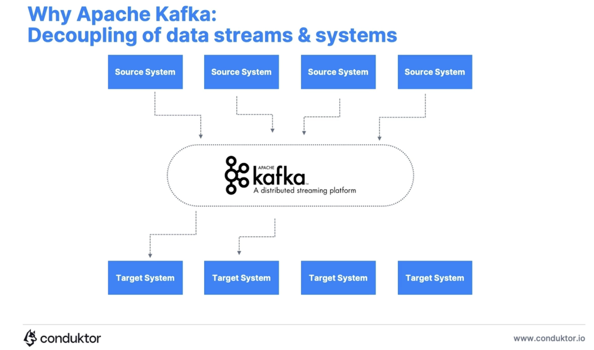
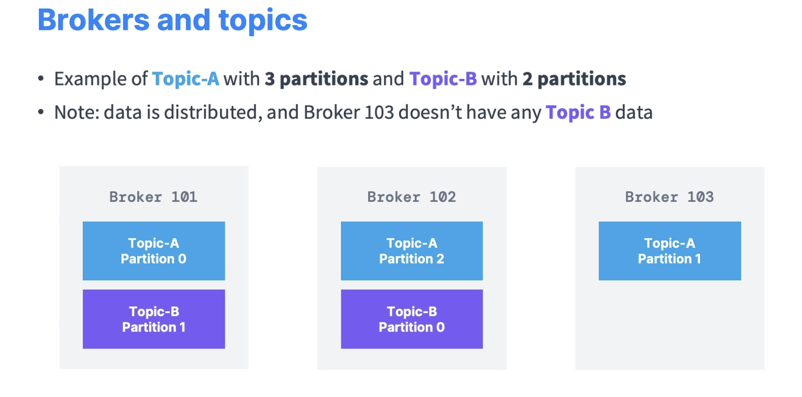
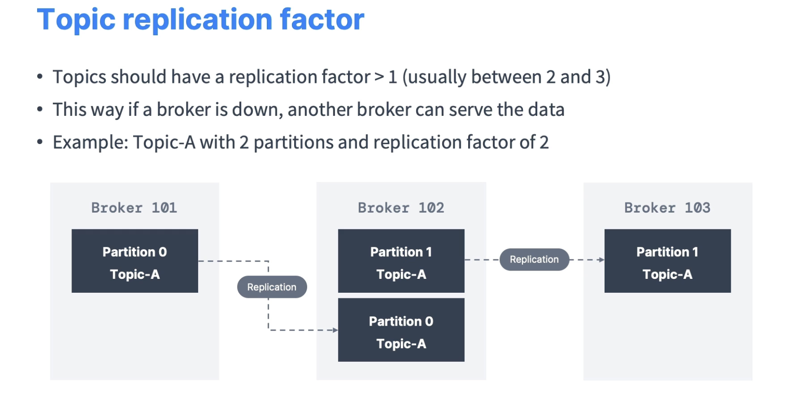
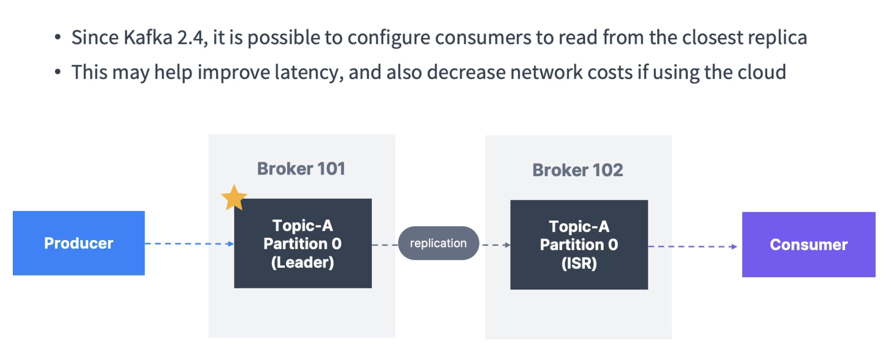
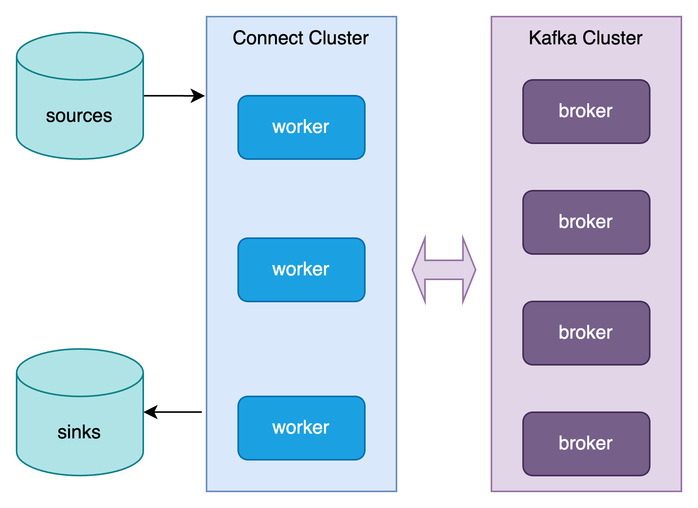
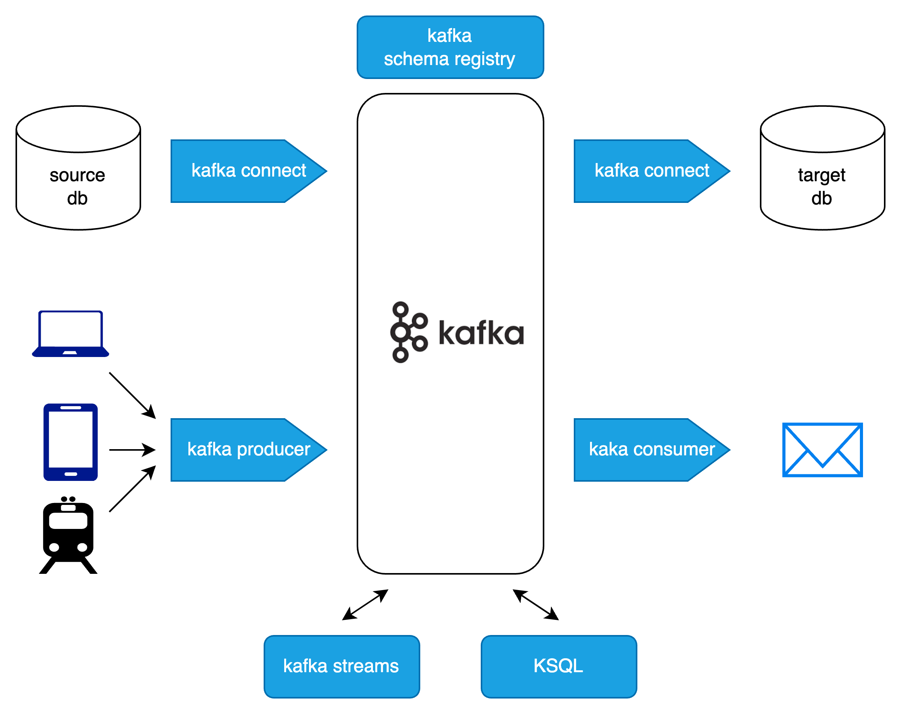
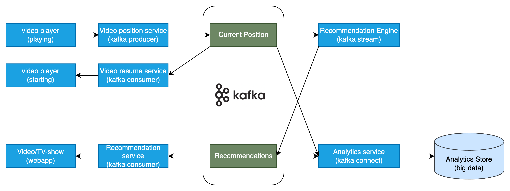
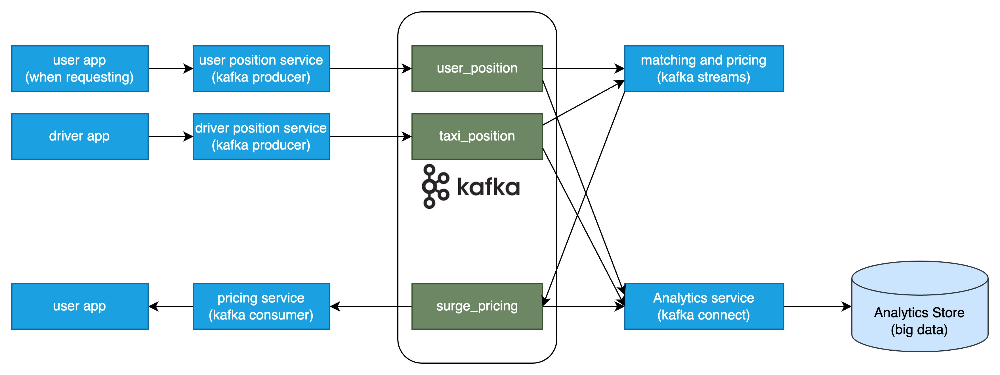
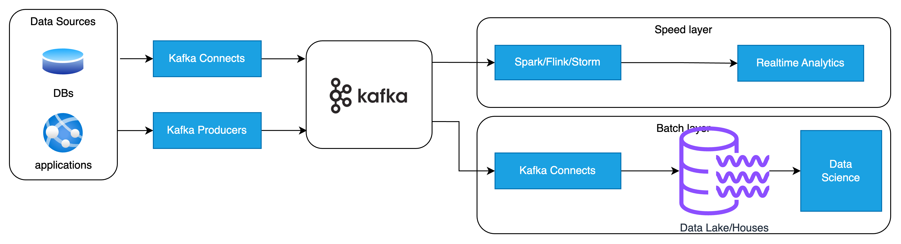
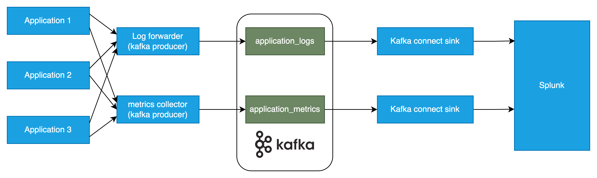

# Data Integration in enterprises

- multiple data sources -> multiple target systems
- different protocols: HTTP, FTP, JDBC, ...
- different formats: binary, Json, CSV, ...
- data schema evolution
- each source system will have an increased load from connections

## Why Kafka



- Decoupling of data streams and systems
- use cases:
  - messaging systems
  - activity tracking
  - metrics gathering
  - application logs gathering
  - stream processing
  - decoupling of system dependencies
  - big data systems
  - pub/sub microservices

# Kafka theory

## Kafka topics

- a particular stream of data
- like a table in a database
- a topic is identified by its **name**
- any kind of message format

Topics are split into partitions

- once the data is written to a partition, it's immutable
- data is kept for a configurable limited time
- offset only have a meaning over a specific partition
- order is guaranteed only within 1 partition
- data is randomly assigned to a partition unless a key is provided
- you can have as many partitions for 1 topic as you want

## Producers

- producers write data to topics (made of partitions)
- producers know to which partition to write (so which Broker has it)
- in case of Kafka broker failures, producers will automatically recover

### Message key

Producer can choose to send a key with the message

- if key = NULL, data is sent to partitions with round robin (partition 0, then 1, ...)
- if key not NULL, then all messages of a same key will always go to the same partition (hashing)

## Consumers

### Consumer groups

- all consumers in an application read data a a consumer group
- each consumer within a group reads data from exclusive partitions
- so if the number of consumers in a group is bigger than the number of topic's patitions, then maybe some of the consumers are not assigned to partitions and will be inactive.
- it's acceptable to have multiple consumer groups on the same topic.
  - use case: each consumer group is for 1 different service
  - the groups read the same topic, but for different usages

### Consumer offsets

## Brokers

- a Kafka cluster is composed of multiple brokers (servers)
- each broker is identified with its ID (integer)
- each broker contains a certain topic partitions




## Topic replication



- 1 topic partition is replicated (across brokers) with a replication factor
- at any time, only 1 broker can be a leader for a given partition
- producers can only send data to the broker that is leader of a partition
- By default
  - Producers can only write data to the leader broker for a partition
  - Consumers can only read data from the leader broker for a partition
- since Kafka 2.4, it's possible to config Consumers to read from the closest replica




## Producer ACK

Producer can choose to receive ACK of data writes
- acks=0: producer will Not wait for ACK (possible loss)
- acks=1: producer will wait for leader ACK (limited data loss)
- acks=all: leader and all replica ACK (no data loss)

## ZooKeeper

- Zookeeper manages brokers
- Zookeeper helps in leader election for partitions
- Zookeeper sends notifications to Kafka in case of changes: new topic, broker dies, broker comes up, topic deleted, ...
- Kafka 2.x cannot work without Zookeeper
- Kafka 3.x can work without Zookeper, using Kafka Raft instead
- Kafka 4.x will not have Zookeeper


# Launch Kafka cluster on local

```bash
$ kafka-storage.sh random-uuid
$ kafka-storage.sh format -t 1w6ODuNGSyGFdSRhZSQ69w -c ./kafka_2.13-3.2.1/config/kraft/server.properties
$ kafka-server-start.sh -c ./kafka_2.13-3.2.1/config/kraft/server.properties  
```

## Create topic

```bash
$ kafka-topics.sh --bootstrap-server localhost:9092 --create --topic first_topic
WARNING: Due to limitations in metric names, topics with a period ('.') or underscore ('_') could collide. To avoid issues it is best to use either, but not both.
Created topic first_topic.
$ kafka-topics.sh --bootstrap-server localhost:9092 --create --topic second_topic --partitions 5
WARNING: Due to limitations in metric names, topics with a period ('.') or underscore ('_') could collide. To avoid issues it is best to use either, but not both.
Created topic second_topic.
$ kafka-topics.sh --bootstrap-server localhost:9092 --list                                      
first_topic
second_topic
$ kafka-topics.sh --bootstrap-server localhost:9092 --describe --topic second_topic
Topic: second_topic	TopicId: Lb8wuacOQUSnZAe8k7nMnA	PartitionCount: 5	ReplicationFactor: 1	Configs: segment.bytes=1073741824
	Topic: second_topic	Partition: 0	Leader: 1	Replicas: 1	Isr: 1
	Topic: second_topic	Partition: 1	Leader: 1	Replicas: 1	Isr: 1
	Topic: second_topic	Partition: 2	Leader: 1	Replicas: 1	Isr: 1
	Topic: second_topic	Partition: 3	Leader: 1	Replicas: 1	Isr: 1
	Topic: second_topic	Partition: 4	Leader: 1	Replicas: 1	Isr: 1
$ kafka-topics.sh --bootstrap-server localhost:9092 --delete --topic first_topic
$ kafka-topics.sh --bootstrap-server localhost:9092 --delete --topic second_topic
$ kafka-topics.sh --bootstrap-server localhost:9092 --list
```

## Producer -> consumer

```bash
$ kafka-console-producer.sh --bootstrap-server localhost:9092 --topic first_topic
>Hello world
>I am using Kafka
>^C
$ kafka-console-consumer.sh --bootstrap-server localhost:9092 --topic first_topic --from-beginning
Hello world
I am using Kafka   
```

### Producer with key

```
$ kafka-console-producer.sh --bootstrap-server localhost:9092 --topic first_topic --property parse.key=true --property key.separator=:
>example key: example value
>name: Stephane
>asdfsd
$ kafka-console-consumer.sh --bootstrap-server localhost:9092 --topic first_topic --from-beginning                                    
Hello world
I am using Kafka
 example value
 Stephane
```

## Partitions

```bash
$ kafka-topics.sh --bootstrap-server localhost:9092 --create --topic second_topic --partitions 3
$ kafka-console-producer.sh --bootstrap-server localhost:9092 --topic second_topic --property partitioner.class=org.apache.kafka.clients.producer.RoundRobinPartitioner
>hello
>my name is Kafka
>one
>2
>3
>4
>5
$ kafka-console-consumer.sh --bootstrap-server localhost:9092 --topic second_topic --from-beginning
my name is Kafka
2
5
hello
one
3
4
```

we see that the consumer does not receive messages in order. It's because of partitions.

```bash
$ kafka-console-consumer.sh --bootstrap-server localhost:9092 --topic second_topic --from-beginning --formatter kafka.tools.DefaultMessageFormatter --property print.key=true --property print.timestamp=true --property print.value=true --property print.partition=true
CreateTime:1737774306090	Partition:1	null	my name is Kafka
CreateTime:1737774348193	Partition:1	null	2
CreateTime:1737774351324	Partition:1	null	5
CreateTime:1737774300917	Partition:0	null	hello
CreateTime:1737774346636	Partition:0	null	one
CreateTime:1737774349235	Partition:2	null	3
CreateTime:1737774349992	Partition:2	null	4
```

### Consumer by groups

```sh
$ kafka-console-producer.sh --bootstrap-server localhost:9092 --topic second_topic --property partitioner.class=org.apache.kafka.clients.producer.RoundRobinPartitioner
>hello
>my name is Kafka
>one
>2
>3
>4
>5
>hello again
>1
>2
>3
>4
>5
>6
>7
>8
>9
>10
>11
>12
>13
>14
>15
>16
>17
>18
>19
>20
>21
>22
>23
>24
>25
>26
>27
>28
>29
>ssdf
>sdfsdf
>sdfsdf
$ kafka-console-consumer.sh --bootstrap-server localhost:9092 --topic second_topic --from-beginning --group my-first-app
my name is Kafka
2
5
hello
one
3
4
7
8
10
12
$ kafka-console-consumer.sh --bootstrap-server localhost:9092 --topic second_topic --from-beginning --group my-first-app
hello again
1
2
3
4
5
6
9
11
13
14
16
21
22
28
$ kafka-console-consumer.sh --bootstrap-server localhost:9092 --topic second_topic --from-beginning --group my-second-app
my name is Kafka
2
5
1
2
5
11
13
15
17
19
20
23
25
27
29
sdfsdf
hello
one
hello again
3
4
6
9
14
16
21
22
28
ssdf
sdfsdf
3
4
7
8
10
12
18
24
26

```

List

```sh
$ kafka-consumer-groups.sh --bootstrap-server localhost:9092 --list
my-first-app
my-second-app
$ kafka-consumer-groups.sh --bootstrap-server localhost:9092 --describe --group my-first-app 

GROUP           TOPIC           PARTITION  CURRENT-OFFSET  LOG-END-OFFSET  LAG             CONSUMER-ID                                           HOST            CLIENT-ID
my-first-app    second_topic    0          14              14              0               console-consumer-2bff1584-365a-4cf7-a461-4c587e377962 /127.0.0.1      console-consumer
my-first-app    second_topic    1          18              18              0               console-consumer-2bff1584-365a-4cf7-a461-4c587e377962 /127.0.0.1      console-consumer
my-first-app    second_topic    2          10              10              0               console-consumer-2bff1584-365a-4cf7-a461-4c587e377962 /127.0.0.1      console-consumer
$ kafka-consumer-groups.sh --bootstrap-server localhost:9092 --describe --group my-second-app

Consumer group 'my-second-app' has no active members.

GROUP           TOPIC           PARTITION  CURRENT-OFFSET  LOG-END-OFFSET  LAG             CONSUMER-ID     HOST            CLIENT-ID
my-second-app   second_topic    0          14              14              0               -               -               -
my-second-app   second_topic    1          17              18              1               -               -               -
my-second-app   second_topic    2          9               10              1               -               -               -
```

If we launch a new consumer for the first group

```
$ kafka-console-consumer.sh --bootstrap-server localhost:9092 --topic second_topic --from-beginning --group my-first-app
$ kafka-consumer-groups.sh --bootstrap-server localhost:9092 --describe --group my-first-app 

GROUP           TOPIC           PARTITION  CURRENT-OFFSET  LOG-END-OFFSET  LAG             CONSUMER-ID                                           HOST            CLIENT-ID
my-first-app    second_topic    0          14              14              0               console-consumer-0eb9af27-ccc4-4bd0-a06f-d40b62b381b3 /127.0.0.1      console-consumer
my-first-app    second_topic    1          18              18              0               console-consumer-0eb9af27-ccc4-4bd0-a06f-d40b62b381b3 /127.0.0.1      console-consumer
my-first-app    second_topic    2          10              10              0               console-consumer-2bff1584-365a-4cf7-a461-4c587e377962 /127.0.0.1      console-consumer
```

### Resetting Offsets

```bash
$ kafka-consumer-groups.sh --bootstrap-server localhost:9092 --group my-first-app --topic second_topic --reset-offsets --to-earliest --dry-run

GROUP                          TOPIC                          PARTITION  NEW-OFFSET     
my-first-app                   second_topic                   0          0              
my-first-app                   second_topic                   1          0              
my-first-app                   second_topic                   2          0
$ kafka-consumer-groups.sh --bootstrap-server localhost:9092 --group my-first-app --topic second_topic --reset-offsets --to-earliest --execute

GROUP                          TOPIC                          PARTITION  NEW-OFFSET     
my-first-app                   second_topic                   0          0              
my-first-app                   second_topic                   1          0              
my-first-app                   second_topic                   2          0  
$ kafka-consumer-groups.sh --bootstrap-server localhost:9092 --describe --group my-first-app                                                  

Consumer group 'my-first-app' has no active members.

GROUP           TOPIC           PARTITION  CURRENT-OFFSET  LOG-END-OFFSET  LAG             CONSUMER-ID     HOST            CLIENT-ID
my-first-app    second_topic    0          0               14              14              -               -               -
my-first-app    second_topic    1          0               18              18              -               -               -
my-first-app    second_topic    2          0               10              10              -               -               -
$ kafka-console-consumer.sh --bootstrap-server localhost:9092 --topic second_topic --group my-first-app
my name is Kafka
2
5
1
2
5
11
13
15
17
19
20
23
25
27
29
sdfsdf
abc
hello
one
hello again
3
4
6
9
14
16
21
22
28
ssdf
sdfsdf
3
4
7
8
10
12
18
24
26
edf
$ kafka-consumer-groups.sh --bootstrap-server localhost:9092 --describe --group my-first-app

GROUP           TOPIC           PARTITION  CURRENT-OFFSET  LOG-END-OFFSET  LAG             CONSUMER-ID                                           HOST            CLIENT-ID
my-first-app    second_topic    0          14              14              0               console-consumer-98925f64-9cbe-4dac-8ae3-7d8d3a76aab3 /127.0.0.1      console-consumer
my-first-app    second_topic    1          18              18              0               console-consumer-98925f64-9cbe-4dac-8ae3-7d8d3a76aab3 /127.0.0.1      console-consumer
my-first-app    second_topic    2          10              10              0               console-consumer-98925f64-9cbe-4dac-8ae3-7d8d3a76aab3 /127.0.0.1      console-consumer
```

# Kafka client - Java app

# Consumer group - Rebalance

## Eager rebalance

- when 1 consumer joins the consumer group
- all consumers stop, give up their membership of partitions
- they rejoin the consumer group and get a new partition assignment

## Cooperative (Incremental) Rebalance

- Reassign a small subset of the partitions from one consumer to another
- Can go through several iterations to find a stable assignment

# Kafka extended APIs

- Kafka producer and consumer are considered **low-level**
- Kafka has new APIs, higher level
  - Kafka Connect for External Source -> Kafka and Kafka -> External Sink
  - Kafka streams solves transformations Kafka -> Kafka
  - Schema Registry helps using Schema in Kafka

## Why Kafka Connect

- Programmers always want to import data from the same sources
  - Databases, JDBC, FTP, IoT, Twitter, SAP HANA, Saleforce
- Programmers always want to store data into the same sinks
  - Databases, Elasticsearch, S3, JDBC



## Kafka schema registry

- Kafka would not verify data schema. Its responsibility is just to log data into partitions.
- The schema reistry must be a separate component
- Producers and Consumers need to be able to talk to it.




# Real world insights

## Partition count & replica factor

- more partitions:
  - better parallelism, better throughput
  - better leverage of brokers if there are many
- practical
  - small cluster (< 6 brokers): 3 x number of brokers
  - large cluster (> 12 brokers): 2 x number of brokers
- more replication factor:
  - better durability
  - better availability
  - more latency (acks=all)
  - more resources (disk, networking)
- practical
  - 3 as a started (cluster must have at least 3 brokers too)

## Topic naming convention

database catalog like naming

```
<message type>.<dataset name>.<data name>.<data format>
```

- **message type**: logging, queuing, user, ..
- **dataset name**: equivalent to database name in RDBMS
- **data name**: equivalent to table name
- **data format**: avro, parquet, json, protobuf, csv, ...

## Case study - MovieFlix

- User can watch TV shows and movies on demand
- Capabilities:
  - make sure users can resume the video where they left off
  - build a user profile in realtime
  - recommend the next movie/show in realtime
  - store all the data in analytics store




- Ideas
  - current position topic:
    - multiple producers
    - should be highly distributed, partitions > 30
    - user_id could be a key -> ordered by user_id
  - recommendation topic
    - smaller volume, partitions
    - user_id could be a key too.

## Case study - GetTaxi

- Match people and taxi drivers in realtime
- Capabilities
  - user should match with a free close driver
  - pricing should depend on if the high demands/free drivers
  - all riding data should be stored in an analytics store for BI



## Case study - Big Data



## Case study - Logging and metrics aggregation



# Kafka in the Enterprise

- multiple data-center/availability-zone brokers
- monitoring
- security
  - in-flight encryption (TLS, ...)
  - in-rest encryption
  - authentication
  - authorization (ACL) to allow who can access what on topics
- Other components
  - Kafka Connect cluster
  - Kafka Schema Registry
  - UI tools
  - Admin tools
- alternatives: managed Kafka clusters as service
  - Amazon MSK, Confluent


# Advance Topic Configurations

## Changing a topic configuration

Some topics may need different parameters than the defaults
- replication factor
- number of partitions
- message size
- compression level
- log cleanup policy
- min insynch replicas
- ...