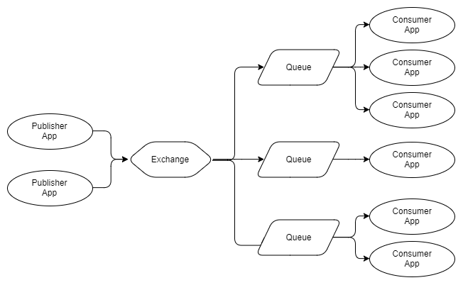
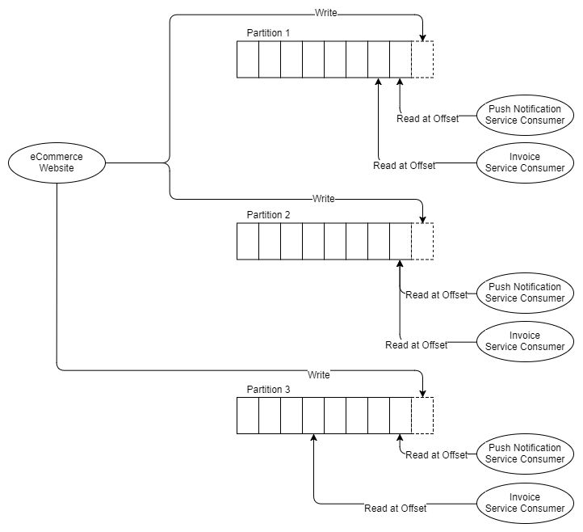

# Blogs

[RabbitMQ vs Apache Kafka](https://jack-vanlightly.com/blog/2017/12/4/rabbitmq-vs-kafka-part-1-messaging-topologies)

## RabbitMQ

- RabbitMQ pushes messages to consumers in a stream.
- Why push and not pull? First of all it is great for low latency. Secondly, ideally when we have competing consumers of a single queue we want to distribute load evenly between them. 

## Kafka

- Kafka is a distributed, replicated commit log. Kafka does not have the concept of a queue
- Kafka does not support competing consumers on a single partition, Kafka's unit of parallelism is the partition itself.
- So the implication is that you need at least as many partitions as the most scaled out consumer

### Consumer groups
- Consumer Groups are like RabbitMQ's competing consumers. Each consumer in the group is an instance of the same application and will process a subset of all the messages in the topic.
- each consumer in a Consumer Group consumes from a different partition of the same topic. 

