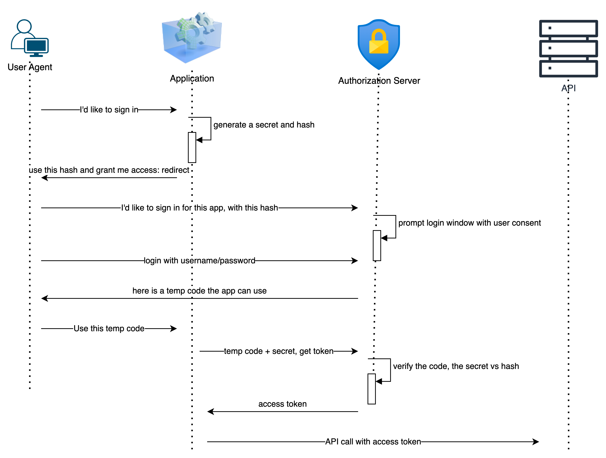

# A brief history of Oauth

[OAuth.net](https://oauth.net/2/)
[modern-guide-to-oauth](https://fusionauth.io/articles/oauth/modern-guide-to-oauth)

- user/password management in the same application
- single sign-on
- access delegation

# API Security concepts

## Roles in OAuth

- User - resource owner
- Device - user agent
- Application - resource client
- API (where the data stay) - resource provider/server
- Authorization Server:
  - make user sign in
  - gives the access token to the client

## Application types

- Confidential clients
  - has credentials: client secret, private key JWT, mTLS, ...
- Public clients
  - no credentials
    - cannot store credentials in codes, configs, ...

## User consent

## Front Channel vs Back Channel

- back channel: normal or secure channel (https)
- front channel: no direct communcation

# OAuth Clients

- applications that are getting and using access tokens to make an API request
  - server app
  - mobile app
  - SPA

# OAuth for server-side applications

390897047ebaa1c25d21a72056964c7a7dba4827a24b0d5b56652749